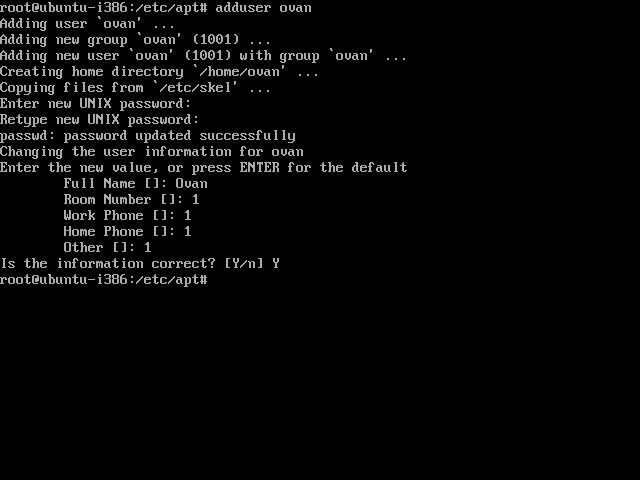
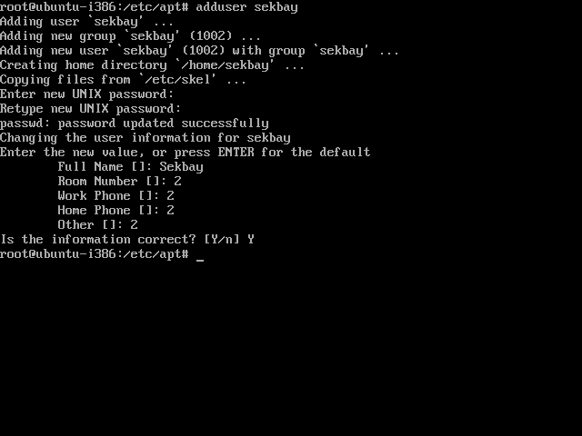
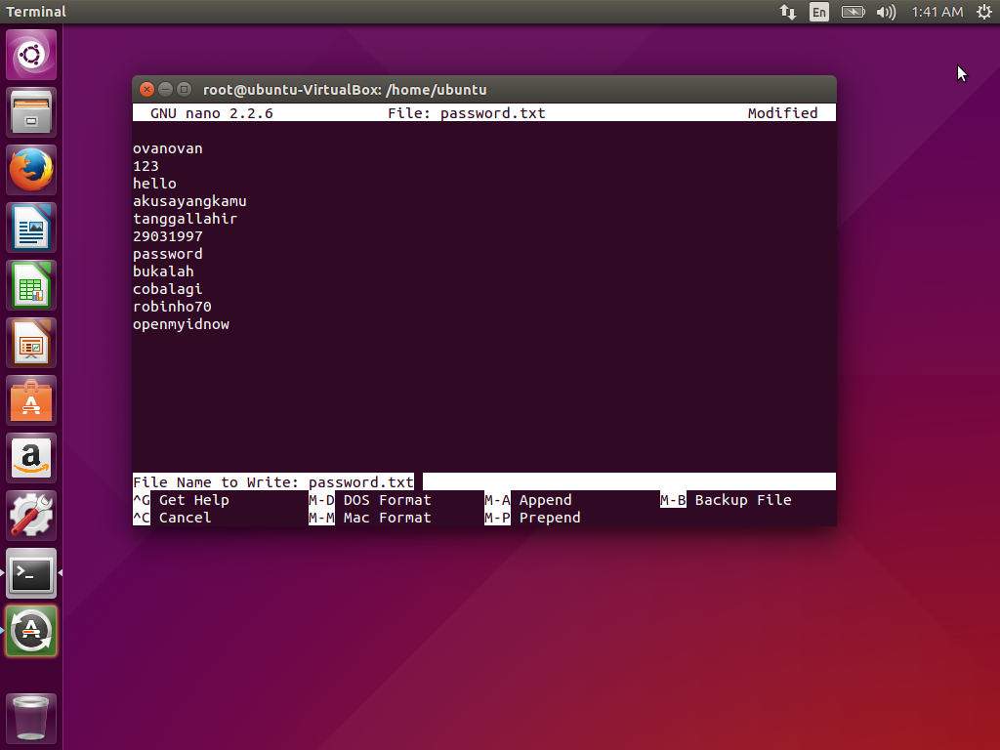
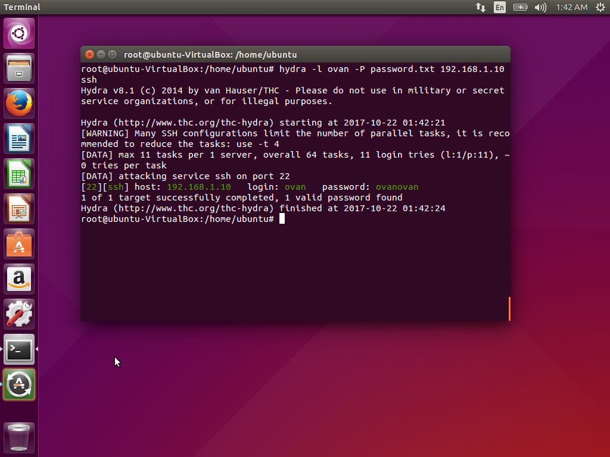
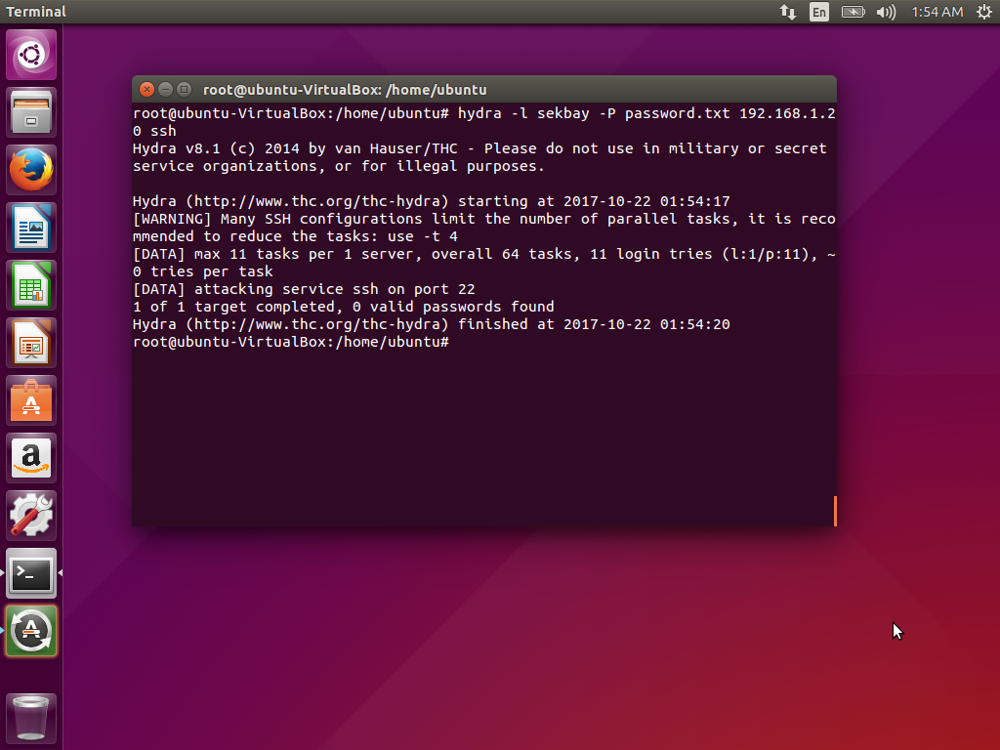

# PKSJ
Repo untuk laporan tugas 1 PKSJ

**Anggota Kelompok**

| NRP         | Nama                     |
|-------------|--------------------------|
| 5114100024  | Ovan                     |
| 5114100097  | Abdul Majid Hasani       |
| 5114100122  | Bayu Sektiaji            |

## Laporan Tugas 1

**Uji Penetrasi 1 :**
* Install sebuah virtual OS dengan Ubuntu Server
* Install SSH server dengan konfigurasi default
* Install satu lagi virtual OS dengan OS bebas
* Pastikan tools untuk SSH brute force attack sudah terinstall
* Lakukan uji penetrasi 1: dengan THC-Hydra / Ncrack dan catat hasil uji penetrasi 1

**Uji Penetrasi 2 :**
* Install fail2ban pada Ubuntu server yang telah diinstall SSH servernya
* Konfigurasilah SSH server agar tidak menggunakan setting default lagi
* Lakukan uji penetrasi 2 dengan tools yang sama dan catat hasilnya

### Pendahuluan

SSH(Secure Shell) adalah  sebuah protokol jaringan kriptografi untuk komunikasi data yang aman, login antarmuka baris perintah, perintah eksekusi jarak jauh, dan layanan jaringan lainnya antara dua jaringan komputer. Ini terkoneksi, melalui saluran aman atau melalui jaringan tidak aman, server dan klien menjalankan server SSH dan SSH program klien secara masing-masing.
Terdapat 2 versi SSH yaitu SSH 1 dan SSH 2. bedanya terletak pada mencakup kedua fitur keamanan dan peningkatan perbaikan tingkat keamanan yang disediakan.
Sebagai contoh, applikasi menggunakan ssh adalah openssh.(https://id.wikipedia.org/wiki/SSH)

SSH brute force attack adalah saat seorang di luar sistem ingin masuk ke dalam sistem yang memiliki username dan password dengan menggunakan 1 list file yang isinya adalah kumpulan dari kemungkinan password untuk username tersebut. Sehingga diperlukan waktu yang cukup lama untuk melakukan proses brute force dan itu juga terdapat kemungkinan password tidak cocok dengan password sebenarnya. (https://en.wikipedia.org/wiki/Brute-force_attack)

### Dasar Teori

**1. OS yang Digunakan**
* **Ubuntu** adalah sistem operasi lengkap berbasis Linux, tersedia secara bebas dan mempunyai dukungan baik yang berasal dari komunitas maupun tenaga ahli profesional. (https://balajarlinux.wordpress.com/2008/02/04/pengenalan-apa-itu-ubuntu-serta-sejarah/)

* **Ubuntu Server** adalah ubuntu yang didesain untuk diinstall di server. Perbedaan mendasar, di Ubuntu Server tidak tersedia GUI. Jika ingin menggunakan ubuntu server artinya user harus bekerja dengan perintah-perintah di layar hitam yang sering disebut konsole. (http://www.candra.web.id/mengenal-ubuntu-server/)

**2. Tools yang Digunakan**

*Cracking Tools*
* **Hydra** adalah sebuah proyek software yang dikembangkan oleh sebuah organisasi bernama "The Hacker's Choice" (THC) yang menggunakan brute force dan dictionary attack untuk menguji untuk password yang lemah atau password sederhana pada satu atau banyak host remote menjalankan berbagai layanan yang berbeda. Ia dirancang sebagai bukti untuk menunjukkan kemudahan cracking password karena password yang dipilih buruk. (http://informatika.stei.itb.ac.id/~rinaldi.munir/Stmik/2010-2011/Makalah2010/MakalahStima2010-062.pdf)

* **Ncrack** adalah alat berkecepatan tinggi scaning jaringan retak .Ncrack dibuat untuk membantu perusahaan dan untuk mengamankan jaringan mereka secara proaktif menguji semua host dan perangkat jaringan dengan password yang buruk. (http://mr-nyepik.blogspot.co.id/2014/04/download-ncrack-network-cracking-tools.html)

*Defending Tool*
* **Fail2Ban** adalah aplikasi log-parsing yang memonitor log sistem untuk mengindentifikasi serangan yang terjadi di server. Saat terjadi serangan, berdasarkan parameter yang sudah diatur sebelumnya, Fail2ban akan menambahkan rule baru ke iptables sehingga memblok IP address dari penyerang, baik untuk periode tertentu maupun secara permanen. (http://www.biznetgiocloud.com/konfigurasi-fail2ban-untuk-mengamankan-server/)

### Persiapan

#### 1. Langkah Instalasi Ubuntu dan Ubuntu Server
1. OS yang kami gunakan untuk tugas 1 ini adalah Ubuntu 15.04 dan Ubuntu Server 14.10.
2. Untuk image Ubuntu 15.04 dapat didownload di (https://virtualboxes.org/images/ubuntu/)
3. Untuk image Ubuntu  Server 14.10 dapat didownload di (https://virtualboxes.org/images/ubuntu-server/)
4. Untuk VirtualBox dapat didownload di (https://www.virtualbox.org/wiki/Downloads)
5. Untuk konfigurasi yang dilakukan di dalam VirtualBox adalah mengganti koneksi dari image ke Bridged  Adapter dan mengubah alokasi memori untuk per image sesuai dengan kebutuhan.
6. Lakukan update untuk kedua OS dengan command
```
sudo apt-get update
```
7. Install hydra pada **Ubuntu 15.04** dengan command
```
sudo apt-get install hydra
```
8. Install openssh (jika belum ada) pada **Ubuntu Server 14.10** dengan command
```
sudo apt-get install openssh
```
9. Install ncrack pada **Ubuntu 15.04** dengan command
```
INI BELOM GAN
```
#### 2. Penambahan User
1. Tambahkan 2 user pada **Ubuntu Server 14.10** dengan password yang berbeda. Alasan mengapa kami menambahkan 2 user adalah 1 user akan memiliki password yang ada di file untuk dibrute force, untuk user satunya memiliki password yang tidak ada di file.
2. Untuk user pertama tambahkan dengan command, lalu ikuti langkah langkah selanjutnya, untuk user pertama akan ditambah dengan username **ovan** dengan password **ovanovan**. Password dari user pertama ada pada password yang dites pada file brute force
```
sudo adduser ovan
```



3. Untuk user kedua tambahkan dengan command, lalu ikuti langkah langkah selanjutnya, untuk user kedua akan ditambah dengan username **sekbay** dengan password **gandalf**. Password dari user kedua tidak ada di file brute force
```
sudo adduser sekbay
```


#### 3. Konfigurasi Server
1. Untuk server mengikuti konfigurasi ip sesuai dengan user
2. Server dan host harus dalam 1 subnet

### Penetrasi
Untuk penetrasi, dibutuhkan 1 file yang berisi password testing.

#### Penetrasi 1
Untuk penetrasi 1, dilakukan 2 skenario pada setiap tools, yaitu
1. Lakukan brute force terhadap user 'ovan' menggunakan list password pada file password.txt
2. Lakukan brute force terhadap user 'sekbay' menggunakan list password pada file password.txt

##### Penetrasi dengan Hydra
1. Gunakan command **Hydra** untuk melakukan brute force dengan command
```
hydra -l ovan -P password.txt 192.168.1.10 ssh
```
Hasil yang akan didapat adalah:



**NOTE**
* Username yang ditarget harus sama dengan username yang ada di server
* Pastikan command **Hydra** dijalankan di direktori yang terdapat file **password.txt**
* Untuk percobaan ini ip server adalah **192.168.1.10**

2. Gunakan command **Hydra** untuk melakukan brute force dengan command
```
hydra -l sekbay -P password.txt 192.168.1.20 ssh
```
Hasil yang akan didapat adalah:



**NOTE**
* Username yang ditarget harus sama dengan username yang ada di server
* Pastikan command **Hydra** dijalankan di direktori yang terdapat file **password.txt**
* Untuk percobaan ini ip server adalah **192.168.1.20**

##### Penetrasi dengan Ncrack

#### Penetrasi 2

##### Konfigurasi Fail2Ban
##### Penetrasi dengan Hydra
##### Penetrasi dengan Ncrack

### Kesimpulan dan Saran


