# Laporan Tugas 2

**Anggota Kelompok**

| NRP         | Nama                        |
|-------------|-----------------------------|
| 5114100024  | Setyassida Novian Putra D   |
| 5114100097  | Abdul Majid Hasani          |
| 5114100122  | Bayu Sektiaji               |


### Pendahuluan

Pada Tugas 2 PKSJ ini, penulis diminta untuk melakukan uji coba vulnerability plug-in Wordpress.

Berikut beberapa Plug-in yang akan penulis uji:
* Wordpress Video Player
* League Manager

Berikut beberapa Tools yang kami gunakan dalam tugas ini:
*WPScan
*SQLMap
*Nikto

### Dasar Teori

**1. OS yang Digunakan**
* **Ubuntu** adalah sistem operasi lengkap berbasis Linux, tersedia secara bebas dan mempunyai dukungan baik yang berasal dari komunitas maupun tenaga ahli profesional. (https://balajarlinux.wordpress.com/2008/02/04/pengenalan-apa-itu-ubuntu-serta-sejarah/)

* **Ubuntu Server** adalah ubuntu yang didesain untuk diinstall di server. Perbedaan mendasar, di Ubuntu Server tidak tersedia GUI. Jika ingin menggunakan ubuntu server artinya user harus bekerja dengan perintah-perintah di layar hitam yang sering disebut konsole. (http://www.candra.web.id/mengenal-ubuntu-server/)

**2. Tools yang Digunakan**

* **Wordpress** adalah sebuah aplikasi sumber terbuka (open source) yang sangat populer digunakan sebagai mesin blog (blog engine). WordPress dibangun dengan bahasa pemrograman PHP dan basis data (database) MySQL. PHP dan MySQL, keduanya merupakan perangkat lunak sumber terbuka (open source software)
(https://id.wordpress.org) 

* **Plug-in : Wordpress Video Player** adalah plugin Wordpress untuk menambahkan, mengatur dan menampilkan video. Ternyata plugin ini dapat dieksploitasi menggunakan blind SQL Injection. Pada referensi disebutkan bahwa dengan menggunakan multiple blind SQL Injenction, user yang dapat login ke dashboard Wordpress dapat mengekstrak informasi dari user lainnya, seperti panjang password bahkan seluruh hash password dari user tersebut.
(https://wordpress.org/plugins/player/)

* **Plug-in : League Manager** adalah plugin wordpress untuk management liga sepakbola di halaman wordpress.Ternyata plugin ini dapat dieksploitasi menggunakan blind SQL Injection. Pada referensi disebutkan bahwa dengan menggunakan multiple blind SQL Injenction, user yang dapat login ke dashboard Wordpress dapat mengekstrak informasi dari user lainnya, seperti panjang password bahkan seluruh hash password dari user tersebut.
(https://wordpress.org/plugins/leaguemanager/)

* **WPScan** merupakan tools vulnerability scanner untuk CMS Wordpress yang ditulis dengan menggunakan bahasa pemrograman ruby, WPScan mampu mendeteksi kerentanan umum serta daftar semua plugin dan themes yang digunakan oleh sebuah website yang menggunakan CMS Wordpress.
(http://anher323.blogspot.co.id/2016/01/cek-celah-vulnerability-cms-wordpress.html)

* **SQLMap** adalah tools opensource yang mendeteksi dan melakukan exploit pada bug SQL injection secara otomatis. dengan melakukan serangan SQL injection seorang attacker dapat mengambil alih serta memanipulasi sebuah database di dalam sebuah server.
(https://rixzaldi.wordpress.com/2016/12/28/tutorial-sql-injection-menggunakan-sql-map/)

* **Nikto** adalah web scanner Open Source (GPL), yang melakukan tes komprehensif terhadap web server. Nikto memiliki kemampuan mendeteksi 3500 file yang berpotensi mendatangkan bahaya / CGIS. Nikto dapat menguji web server dengan cepat, tetapi mudah dilihat pada log. Tapi sangat berguna untuk menguji suatu web server. Menurut saya nikto ini pembaca web server yang memiliki celah keamanan CVE maupun OSVDB (Open Source Vulnerability Data Base).
(https://rixzaldi.wordpress.com/2017/01/04/nikto-web-vulnerability-scanner/)

### Persiapan

#### 1. Langkah Instalasi Ubuntu dan Ubuntu Server
1. OS yang kami gunakan untuk tugas 1 ini adalah Ubuntu 15.04 dan Ubuntu Server 14.10.
2. Untuk image Ubuntu 15.04 dapat didownload di (https://virtualboxes.org/images/ubuntu/)
3. Untuk image Ubuntu  Server 14.10 dapat didownload di (https://virtualboxes.org/images/ubuntu-server/)
4. Untuk VirtualBox dapat didownload di (https://www.virtualbox.org/wiki/Downloads)
5. Untuk konfigurasi yang dilakukan di dalam VirtualBox adalah mengganti koneksi dari image ke Bridged  Adapter dan mengubah alokasi memori untuk per image sesuai dengan kebutuhan.
6. Lakukan update untuk kedua OS dengan command
```
sudo apt-get update
```
#### 2. Langkah Instalasi Wordpress

##### a. Setting MYSQL

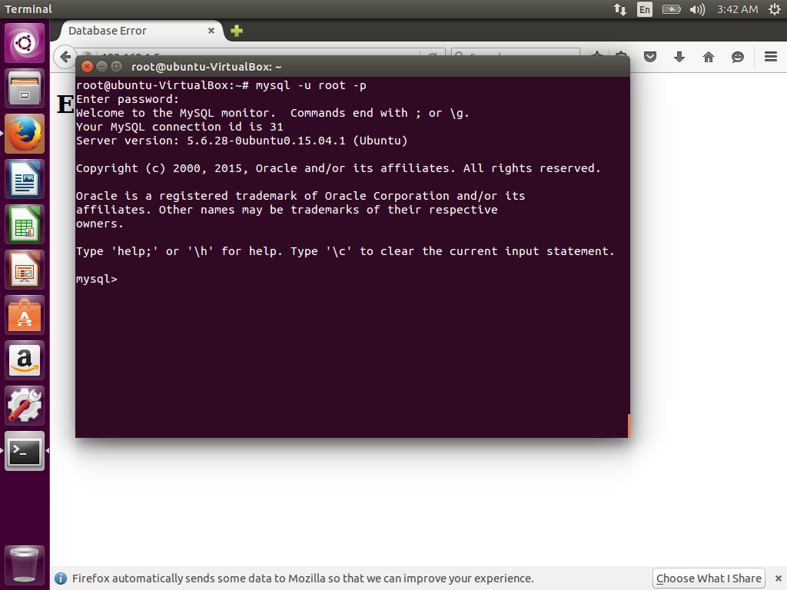

* Langkah pertama yang akan kita ambil adalah persiapan. WordPress menggunakan database relasional untuk mengelola dan menyimpan informasi situs dan pengguna.
 
* Kami telah menginstal MySQL, yang dapat menyediakan fungsionalitas ini, namun kami perlu membuat database dan pengguna untuk WordPress bekerja sama.

* Untuk memulai, masuk ke akun root (administratif) MySQL dengan mengeluarkan perintah ini:

```
mysql -u root -p
```

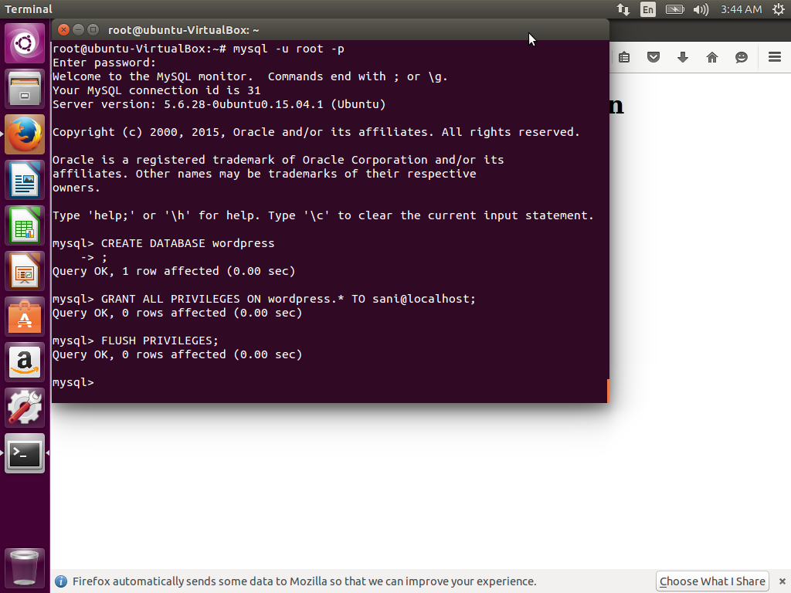

* Anda akan diminta memasukkan kata sandi yang Anda tetapkan untuk akun root MySQL saat Anda menginstal perangkat lunak. Anda kemudian akan diberi command prompt MySQL.

Pertama, kita bisa membuat database terpisah yang bisa dikendalikan WordPress. Anda bisa memanggil ini apapun yang Anda mau, tapi saya akan menyebutnya wordpress karena bersifat deskriptif dan sederhana. Masukkan perintah ini untuk membuat database:

```
CREATE USER wordpressuser@localhost IDENTIFIED BY 'password';
```

* Pada titik ini, Anda memiliki database dan akun pengguna, masing-masing dibuat khusus untuk WordPress. Namun, kedua komponen ini belum memiliki hubungan. Pengguna tidak memiliki akses ke database.

* Mari kita perbaiki dengan memberikan akses pengguna akun kami ke database kami dengan perintah ini:

```
GRANT ALL PRIVILEGES ON wordpress.* TO wordpressuser@localhost;
```

* Sekarang pengguna memiliki akses ke database. Kita perlu menyiram hak istimewa sehingga instance MySQL saat ini mengetahui tentang perubahan hak istimewa yang baru saja kita buat:

```
FLUSH PRIVILEGES;
```

* We're all set now. We can exit out of the MySQL prompt by typing:

```
exit
```


##### b. Setting Apache2 + Dependencies


-> 4 7 8 9 10
##### c. Setting Wordpress

* Selanjutnya, kita akan mendownload file WordPress yang sebenarnya dari situs web proyek.

* Untungnya, tim WordPress selalu menghubungkan versi perangkat lunak terbaru yang paling stabil ke URL yang sama, jadi kami bisa mendapatkan versi WordPress paling mutakhir dengan mengetikkan ini:

```
cd ~
wget http://wordpress.org/latest.tar.gz
```

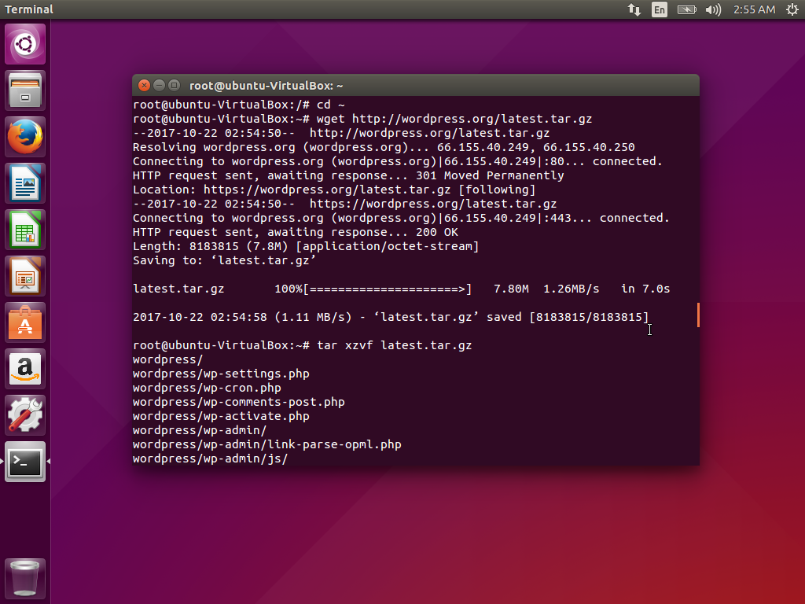

* Ini akan mendownload file terkompresi yang berisi konten direktori arsip dari file WordPress ke direktori home kita.

* Kita bisa mengekstrak file untuk membangun kembali direktori WordPress yang kita butuhkan dengan mengetikkan:

```
tar xzvf latest.tar.gz
```

* Ini akan membuat sebuah direktori bernama wordpress di home directory anda.

* Sementara kita mendownload barang, kita juga harus mendapatkan beberapa paket lagi yang kita butuhkan. Kita bisa mendapatkan ini langsung dari repositori default Ubuntu setelah kita memperbarui indeks paket lokal kita:

```
sudo apt-get update
sudo apt-get install php5-gd libssh2-php
```

###### Configure WordPress

* Sebagian besar konfigurasi yang akan kita lakukan akan melalui antarmuka web nanti. Namun, kita perlu melakukan beberapa pekerjaan dari baris perintah sebelum kita bisa menjalankan dan menjalankan ini.

* Mulailah dengan pindah ke direktori WordPress yang baru saja Anda undload:

```
cd ~/wordpress
```

* File konfigurasi contoh yang paling sesuai dengan konfigurasi yang kami butuhkan disertakan secara default. Namun, kita perlu menyalinnya ke lokasi file konfigurasi default agar WordPress mengenali file tersebut. Lakukan itu sekarang dengan mengetik:

```
cp wp-config-sample.php wp-config.php
```

* Sekarang kita memiliki file konfigurasi untuk digunakan, kita bisa menghasilkan beberapa kunci rahasia yang membantu mengamankan instalasi. WordPress menyediakan generator yang aman untuk nilai-nilai ini sehingga Anda tidak perlu mencoba menghasilkan nilai bagus sendiri. Ini hanya digunakan secara internal, jadi tidak akan merugikan kegunaan untuk memiliki nilai yang kompleks dan aman di sini.

* Untuk mendapatkan nilai aman dari generator kunci rahasia WordPress, ketik:

```
curl -s https://api.wordpress.org/secret-key/1.1/salt/
```

* Anda akan mendapatkan kembali nilai unik yang terlihat seperti ini:

```

```


-> 3 5 6 11 12 13 14
##### d. Install Plugin
-> 15

### Penetrasi 

#### Langkah-langkah NIKTO
1. Install nikto
```
apt-get install nikto
```

2. Update nikto
```
nikto -update
```

3. Jalankan nikto dengan command dibawah ini
```
nikto -h 192.168.3.5
```

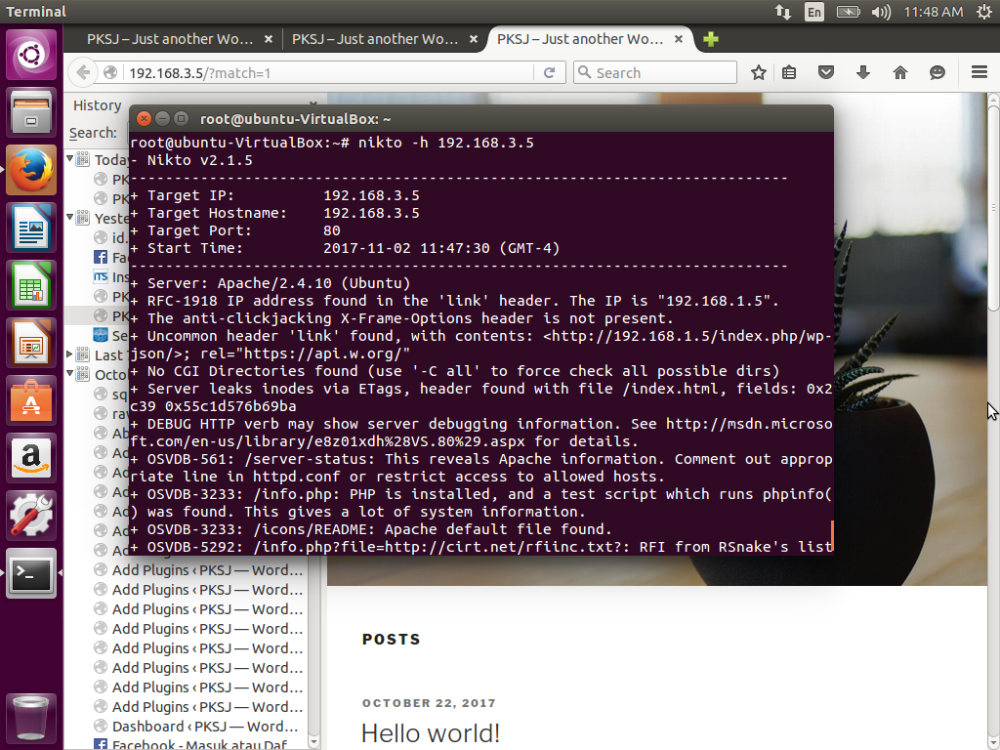
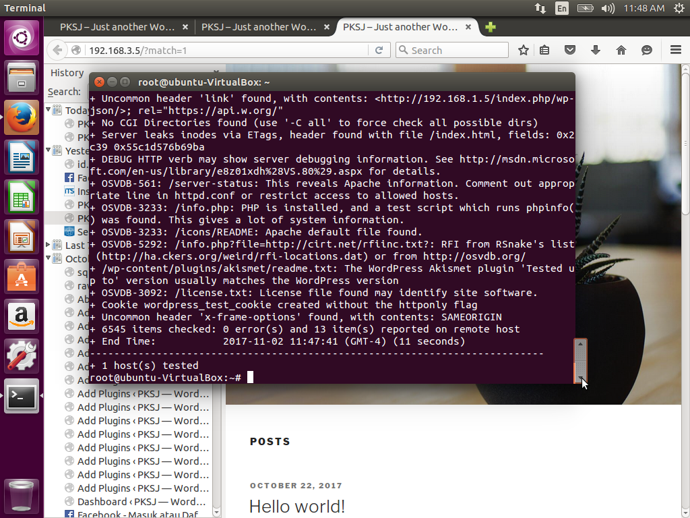

**NOTE**
* 192.168.3.5 adalah alamat wordpress yang akan diserang

#### Langkah-langkah SQLmap
1. Download sqlmap
```
git clone https://github.com/sqlmapproject/sqlmap.git
```

2. Untuk menjalankan wpscan, masukan command di bawah ini
```
python sqlmap.py -u 'http://192.168.3.5/?match=1' --level 5 --risk 2 --dbms mysql
```

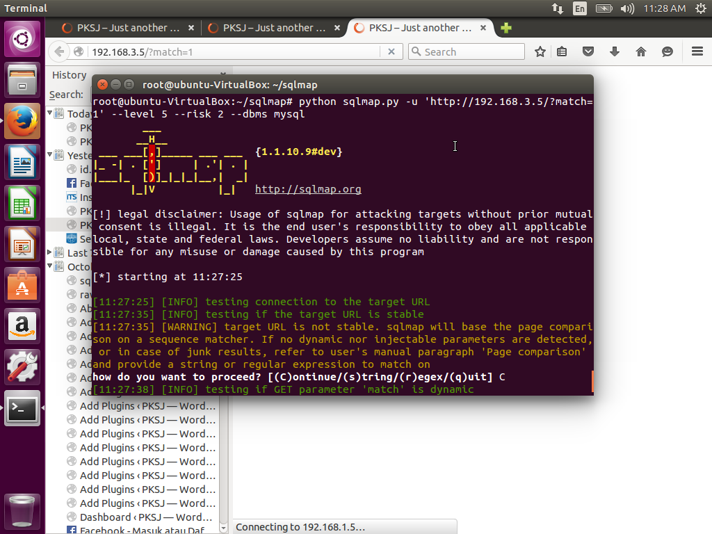
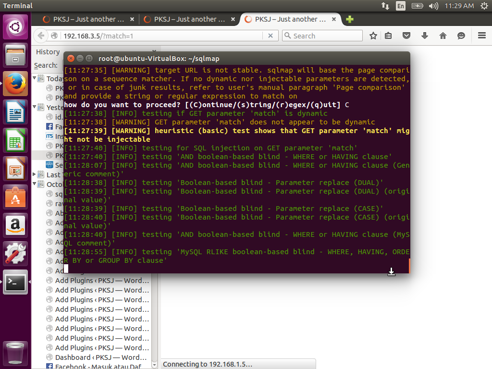

**NOTE**
* 192.168.3.5/?match=1 adalah alamat wordpress yang akan diserang

#### Langkah-langkah WPSCAN
1. Install dependencies pada ubuntu
```
sudo apt-get install gcc git ruby2.3 ruby2.3-dev libcurl4-openssl-dev make zlib1g-dev
```

2. Download wpscan
```
git clone https://github.com/wpscanteam/wpscan.git
```

3. Masuk ke dalam folder wpscan lalu install wpscan dengan command
```
sudo gem install bundler && bundle install --without test
```

4. Untuk menjalankan wpscan, masukan command di bawah ini
```
ruby wpscan.rb -u 192.168.3.5 --enumerate vp
```

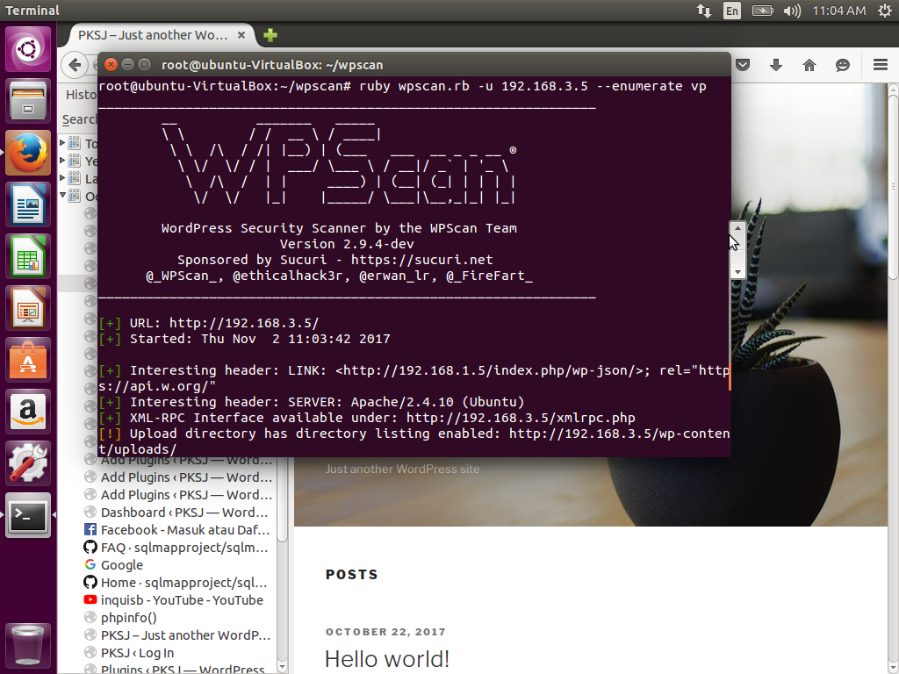
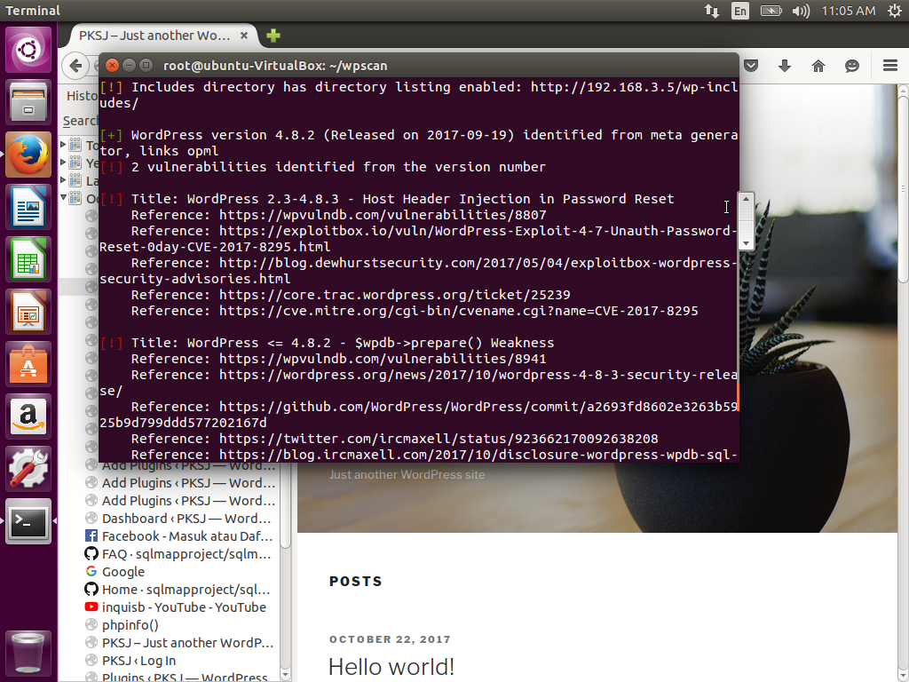
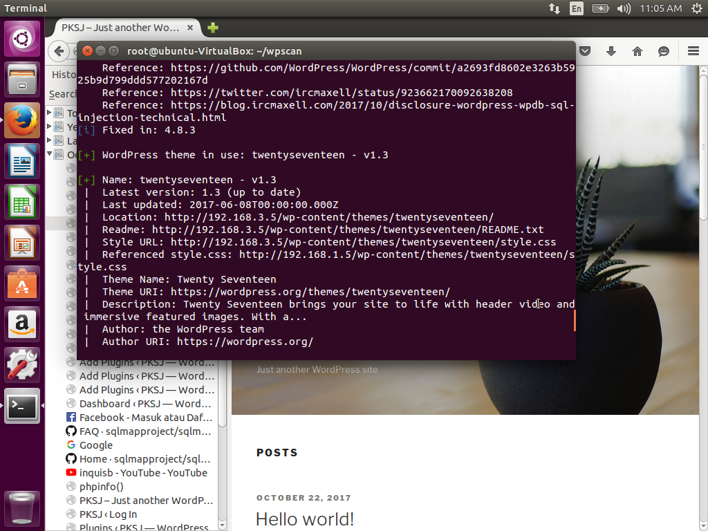
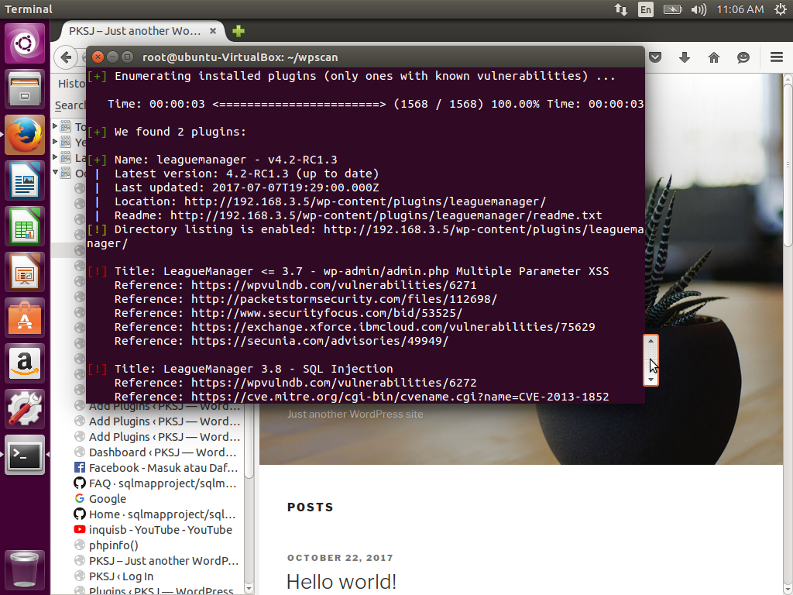
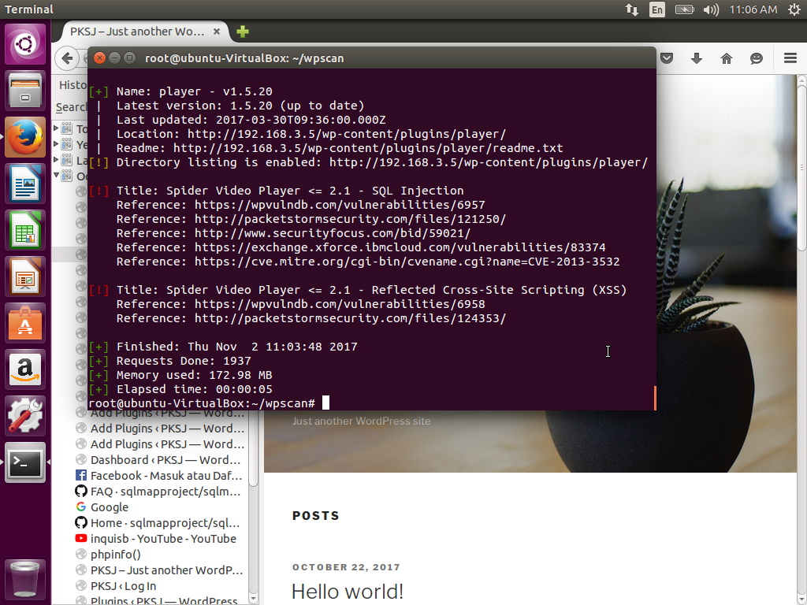

**NOTE**
* 192.168.3.5 adalah alamat wordpress yang akan diserang
* --enumerate adalah command untuk menjalankan semua enumeration tools
* vp adalah command untuk target plugins yang rentan diserang

### Kesimpulan dan Saran
* Terdapat Beberapa cara untuk pengamanan sebuah server dari serangan bruteforce. pertama memilih password server yang susah untuk ditebak, kedua melakukan config pada ssh bruteforce, ketiga menginstall tool yang dapat membantu keamanan salah satu contohnya adalah file2ban.
* Ketika penetrasi dilakukan dengan NCrack dimana service FILE 2 BAN di server side sedang running, host side dapat menemukan password yang dari user yang ingin kita cari, akan tetapi secara otomatis ip address dari host side akan di banned sehingga tidak dapat melakukan komunikasi dengan server side.


