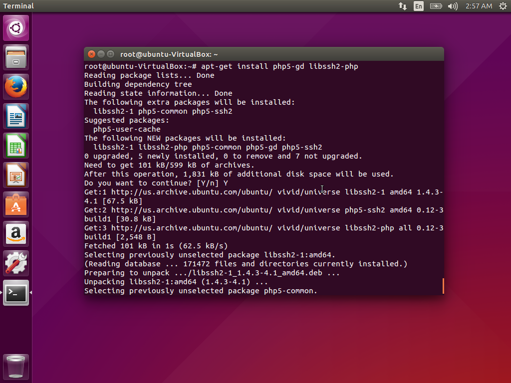
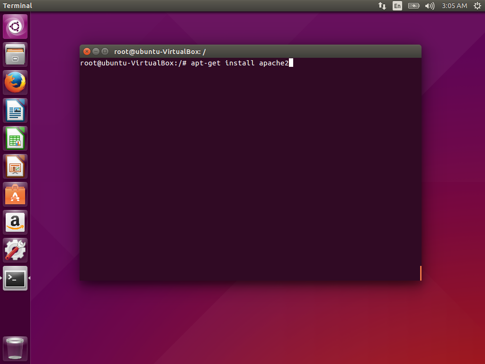
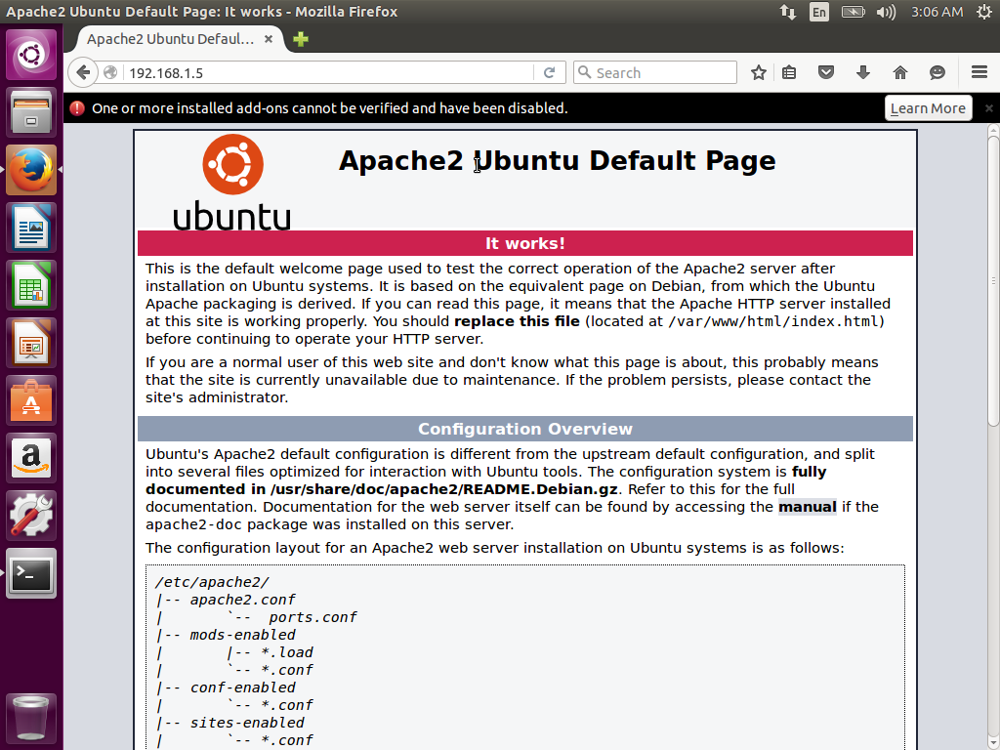
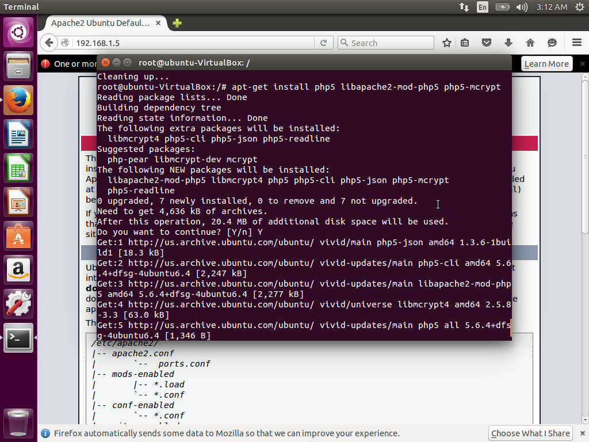
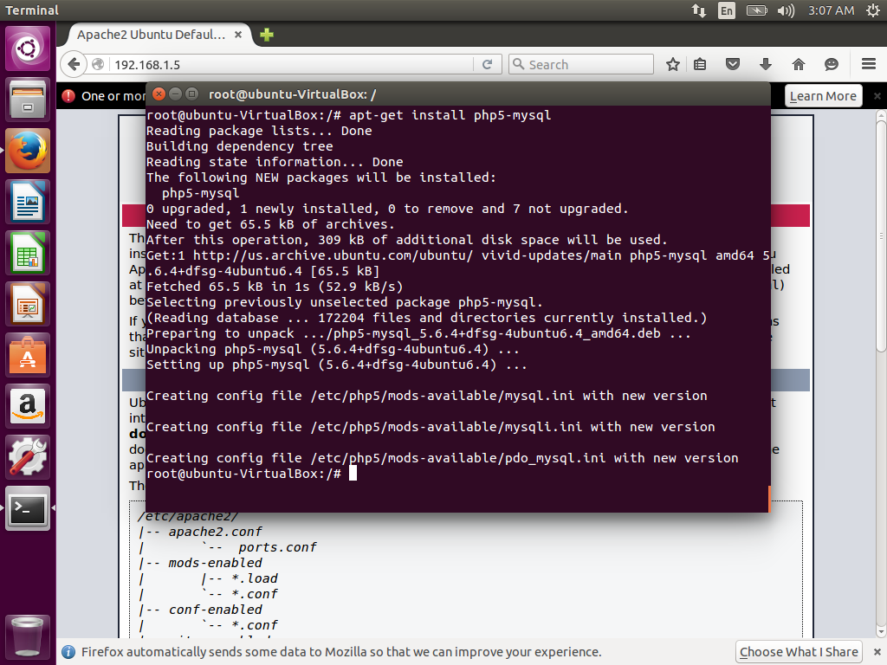

# Laporan Tugas 2

**Anggota Kelompok**

| NRP         | Nama                        |
|-------------|-----------------------------|
| 5114100024  | Setyassida Novian Putra D   |
| 5114100097  | Abdul Majid Hasani          |
| 5114100122  | Bayu Sektiaji               |


### Pendahuluan

Pada Tugas 2 PKSJ ini, penulis diminta untuk melakukan uji coba vulnerability plug-in Wordpress.

Berikut beberapa Plug-in yang akan penulis uji:
* Wordpress Video Player
* League Manager

Berikut beberapa Tools yang kami gunakan dalam tugas ini:
*WPScan
*SQLMap
*Nikto

### Dasar Teori

**1. OS yang Digunakan**
* **Ubuntu** adalah sistem operasi lengkap berbasis Linux, tersedia secara bebas dan mempunyai dukungan baik yang berasal dari komunitas maupun tenaga ahli profesional. (https://balajarlinux.wordpress.com/2008/02/04/pengenalan-apa-itu-ubuntu-serta-sejarah/)

* **Ubuntu Server** adalah ubuntu yang didesain untuk diinstall di server. Perbedaan mendasar, di Ubuntu Server tidak tersedia GUI. Jika ingin menggunakan ubuntu server artinya user harus bekerja dengan perintah-perintah di layar hitam yang sering disebut konsole. (http://www.candra.web.id/mengenal-ubuntu-server/)

**2. Tools yang Digunakan**

* **Wordpress** adalah sebuah aplikasi sumber terbuka (open source) yang sangat populer digunakan sebagai mesin blog (blog engine). WordPress dibangun dengan bahasa pemrograman PHP dan basis data (database) MySQL. PHP dan MySQL, keduanya merupakan perangkat lunak sumber terbuka (open source software)
(https://id.wordpress.org) 

* **Plug-in : Wordpress Video Player** adalah plugin Wordpress untuk menambahkan, mengatur dan menampilkan video. Ternyata plugin ini dapat dieksploitasi menggunakan blind SQL Injection. Pada referensi disebutkan bahwa dengan menggunakan multiple blind SQL Injenction, user yang dapat login ke dashboard Wordpress dapat mengekstrak informasi dari user lainnya, seperti panjang password bahkan seluruh hash password dari user tersebut.
(https://wordpress.org/plugins/player/)

* **Plug-in : League Manager** adalah plugin wordpress untuk management liga sepakbola di halaman wordpress.Ternyata plugin ini dapat dieksploitasi menggunakan blind SQL Injection. Pada referensi disebutkan bahwa dengan menggunakan multiple blind SQL Injenction, user yang dapat login ke dashboard Wordpress dapat mengekstrak informasi dari user lainnya, seperti panjang password bahkan seluruh hash password dari user tersebut.
(https://wordpress.org/plugins/leaguemanager/)

* **WPScan** merupakan tools vulnerability scanner untuk CMS Wordpress yang ditulis dengan menggunakan bahasa pemrograman ruby, WPScan mampu mendeteksi kerentanan umum serta daftar semua plugin dan themes yang digunakan oleh sebuah website yang menggunakan CMS Wordpress.
(http://anher323.blogspot.co.id/2016/01/cek-celah-vulnerability-cms-wordpress.html)

* **SQLMap** adalah tools opensource yang mendeteksi dan melakukan exploit pada bug SQL injection secara otomatis. dengan melakukan serangan SQL injection seorang attacker dapat mengambil alih serta memanipulasi sebuah database di dalam sebuah server.
(https://rixzaldi.wordpress.com/2016/12/28/tutorial-sql-injection-menggunakan-sql-map/)

* **Nikto** adalah web scanner Open Source (GPL), yang melakukan tes komprehensif terhadap web server. Nikto memiliki kemampuan mendeteksi 3500 file yang berpotensi mendatangkan bahaya / CGIS. Nikto dapat menguji web server dengan cepat, tetapi mudah dilihat pada log. Tapi sangat berguna untuk menguji suatu web server. Menurut saya nikto ini pembaca web server yang memiliki celah keamanan CVE maupun OSVDB (Open Source Vulnerability Data Base).
(https://rixzaldi.wordpress.com/2017/01/04/nikto-web-vulnerability-scanner/)

### Persiapan

#### 1. Langkah Instalasi Ubuntu dan Ubuntu Server
1. OS yang kami gunakan untuk tugas 1 ini adalah Ubuntu 15.04 dan Ubuntu Server 14.10.
2. Untuk image Ubuntu 15.04 dapat didownload di (https://virtualboxes.org/images/ubuntu/)
3. Untuk image Ubuntu  Server 14.10 dapat didownload di (https://virtualboxes.org/images/ubuntu-server/)
4. Untuk VirtualBox dapat didownload di (https://www.virtualbox.org/wiki/Downloads)
5. Untuk konfigurasi yang dilakukan di dalam VirtualBox adalah mengganti koneksi dari image ke Bridged  Adapter dan mengubah alokasi memori untuk per image sesuai dengan kebutuhan.
6. Lakukan update untuk kedua OS dengan command
```
sudo apt-get update
```
#### 2. Langkah Instalasi Wordpress

##### a. Setting MYSQL


* Langkah pertama yang akan kita ambil adalah persiapan. WordPress menggunakan database relasional untuk mengelola dan menyimpan informasi situs dan pengguna.
 
* Kami telah menginstal MySQL, yang dapat menyediakan fungsionalitas ini, namun kami perlu membuat database dan pengguna untuk WordPress bekerja sama.

* Untuk memulai, masuk ke akun root (administratif) MySQL dengan mengeluarkan perintah ini:

```
mysql -u root -p
```


* Anda akan diminta memasukkan kata sandi yang Anda tetapkan untuk akun root MySQL saat Anda menginstal perangkat lunak. Anda kemudian akan diberi command prompt MySQL.

Pertama, kita bisa membuat database terpisah yang bisa dikendalikan WordPress. Anda bisa memanggil ini apapun yang Anda mau, tapi saya akan menyebutnya wordpress karena bersifat deskriptif dan sederhana. Masukkan perintah ini untuk membuat database:

```
CREATE USER wordpressuser@localhost IDENTIFIED BY 'password';
```

* Pada titik ini, Anda memiliki database dan akun pengguna, masing-masing dibuat khusus untuk WordPress. Namun, kedua komponen ini belum memiliki hubungan. Pengguna tidak memiliki akses ke database.

* Mari kita perbaiki dengan memberikan akses pengguna akun kami ke database kami dengan perintah ini:

```
GRANT ALL PRIVILEGES ON wordpress.* TO wordpressuser@localhost;
```

* Sekarang pengguna memiliki akses ke database. Kita perlu menyiram hak istimewa sehingga instance MySQL saat ini mengetahui tentang perubahan hak istimewa yang baru saja kita buat:

```
FLUSH PRIVILEGES;
```

* We're all set now. We can exit out of the MySQL prompt by typing:

```
exit
```


##### b. Setting Apache2 + Dependencies

* Untuk install PHP5 kita dapat mengetikkan script seperti gambar dibawah



* Server web Apache adalah salah satu server web terpopuler di dunia. Ini terdokumentasi dengan baik, dan telah digunakan secara luas untuk sebagian besar sejarah web, yang menjadikannya pilihan default untuk hosting sebuah situs web.

* Kita bisa menginstal Apache dengan mudah menggunakan manajer paket Ubuntu, apt. Seorang manajer paket mengizinkan kita untuk menginstal perangkat lunak yang paling bebas dari repositori yang dikelola oleh Ubuntu. Anda bisa belajar lebih banyak tentang cara menggunakan apt di sini.

* Untuk tujuan kita, kita bisa memulai dengan mengetikkan perintah berikut:

```
sudo apt-get update
sudo apt-get install apache2
```



* Berikut hasil testing dari apache yang barusan kami install



* Untuk install PHP5 dan dependency nya kita dapat mengetikkan script seperti gambar dibawah






##### c. Setting Wordpress

* Selanjutnya, kita akan mendownload file WordPress yang sebenarnya dari situs web proyek.

* Untungnya, tim WordPress selalu menghubungkan versi perangkat lunak terbaru yang paling stabil ke URL yang sama, jadi kami bisa mendapatkan versi WordPress paling mutakhir dengan mengetikkan ini:

```
cd ~
wget http://wordpress.org/latest.tar.gz
```


* Ini akan mendownload file terkompresi yang berisi konten direktori arsip dari file WordPress ke direktori home kita.

* Kita bisa mengekstrak file untuk membangun kembali direktori WordPress yang kita butuhkan dengan mengetikkan:

```
tar xzvf latest.tar.gz
```

* Ini akan membuat sebuah direktori bernama wordpress di home directory anda.

* Sementara kita mendownload barang, kita juga harus mendapatkan beberapa paket lagi yang kita butuhkan. Kita bisa mendapatkan ini langsung dari repositori default Ubuntu setelah kita memperbarui indeks paket lokal kita:

```
sudo apt-get update
sudo apt-get install php5-gd libssh2-php
```

###### Configure WordPress

* Sebagian besar konfigurasi yang akan kita lakukan akan melalui antarmuka web nanti. Namun, kita perlu melakukan beberapa pekerjaan dari baris perintah sebelum kita bisa menjalankan dan menjalankan ini.

* Mulailah dengan pindah ke direktori WordPress yang baru saja Anda undload:

```
cd ~/wordpress
```

* File konfigurasi contoh yang paling sesuai dengan konfigurasi yang kami butuhkan disertakan secara default. Namun, kita perlu menyalinnya ke lokasi file konfigurasi default agar WordPress mengenali file tersebut. Lakukan itu sekarang dengan mengetik:

```
cp wp-config-sample.php wp-config.php
```

* Sekarang kita memiliki file konfigurasi untuk digunakan, kita bisa menghasilkan beberapa kunci rahasia yang membantu mengamankan instalasi. WordPress menyediakan generator yang aman untuk nilai-nilai ini sehingga Anda tidak perlu mencoba menghasilkan nilai bagus sendiri. Ini hanya digunakan secara internal, jadi tidak akan merugikan kegunaan untuk memiliki nilai yang kompleks dan aman di sini.

* Untuk mendapatkan nilai aman dari generator kunci rahasia WordPress, ketik:

```
curl -s https://api.wordpress.org/secret-key/1.1/salt/
```

* Anda akan mendapatkan kembali nilai unik yang terlihat seperti ini:

```
define('AUTH_KEY',         '1jl/vqfs<XhdXoAPz9 DO NOT COPY THESE VALUES c_j{iwqD^<+c9.k<J@4H');
define('SECURE_AUTH_KEY',  'E2N-h2]Dcvp+aS/p7X DO NOT COPY THESE VALUES {Ka(f;rv?Pxf})CgLi-3');
define('LOGGED_IN_KEY',    'W(50,{W^,OPB%PB<JF DO NOT COPY THESE VALUES 2;y&,2m%3]R6DUth[;88');
define('NONCE_KEY',        'll,4UC)7ua+8<!4VM+ DO NOT COPY THESE VALUES #`DXF+[$atzM7 o^-C7g');
define('AUTH_SALT',        'koMrurzOA+|L_lG}kf DO NOT COPY THESE VALUES  07VC*Lj*lD&?3w!BT#-');
define('SECURE_AUTH_SALT', 'p32*p,]z%LZ+pAu:VY DO NOT COPY THESE VALUES C-?y+K0DK_+F|0h{!_xY');
define('LOGGED_IN_SALT',   'i^/G2W7!-1H2OQ+t$3 DO NOT COPY THESE VALUES t6**bRVFSD[Hi])-qS`|');
define('NONCE_SALT',       'Q6]U:K?j4L%Z]}h^q7 DO NOT COPY THESE VALUES 1% ^qUswWgn+6&xqHN&%');
```

* Ini adalah baris konfigurasi yang bisa kita tempel langsung di file konfigurasi kita untuk mengatur kunci aman. Salin output yang Anda terima sekarang.

* Selanjutnya, mari kita buka file konfigurasi di editor teks:

```
nano wp-config.php
```

* Temukan bagian yang berisi nilai dummy untuk pengaturan tersebut. Ini akan terlihat seperti ini:

```
. . .

define('AUTH_KEY',         'VALUES COPIED FROM THE COMMAND LINE');
define('SECURE_AUTH_KEY',  'VALUES COPIED FROM THE COMMAND LINE');
define('LOGGED_IN_KEY',    'VALUES COPIED FROM THE COMMAND LINE');
define('NONCE_KEY',        'VALUES COPIED FROM THE COMMAND LINE');
define('AUTH_SALT',        'VALUES COPIED FROM THE COMMAND LINE');
define('SECURE_AUTH_SALT', 'VALUES COPIED FROM THE COMMAND LINE');
define('LOGGED_IN_SALT',   'VALUES COPIED FROM THE COMMAND LINE');
define('NONCE_SALT',       'VALUES COPIED FROM THE COMMAND LINE');

. . .
```


* Setelah itu, satu-satunya modifikasi yang perlu dilakukan adalah parameter yang menyimpan informasi database kami.

* Kita perlu menemukan setting untuk DB_NAME, DB_USER, dan DB_PASSWORD agar WordPress dapat menghubungkan dan mengotentikasi dengan benar ke database yang kita buat.

* Isi nilai parameter ini dengan informasi untuk database yang anda buat. Seharusnya terlihat seperti ini:

```
// ** MySQL settings - You can get this info from your web host ** //
/** The name of the database for WordPress */
define('DB_NAME', 'wordpress');

/** MySQL database username */
define('DB_USER', 'wordpressuser');

/** MySQL database password */
define('DB_PASSWORD', 'password');
```


* Inilah satu-satunya nilai yang perlu Anda ubah.

* Setelah selesai, simpan dan tutup filenya.

###### Copy File ke Document Root

* Sekarang setelah aplikasi kita dikonfigurasi, kita perlu menyalinnya ke akar dokumen Apache, di mana bisa disajikan ke pengunjung situs web kita.

* Salah satu cara termudah dan paling dapat diandalkan untuk mentransfer file dari direktori ke direktori adalah dengan perintah rsync. Ini menjaga hak akses dan memiliki fitur integritas data yang baik.

* Lokasi root dokumen pada panduan 14.3 LAMP Ubuntu adalah / var / www / html /. Kita bisa mentransfer file WordPress kita disana dengan mengetikkan:

```
sudo rsync -avP ~/wordpress/ /var/www/html/
```


* Ini akan dengan aman menyalin semua isi dari direktori yang Anda kumpulkan ke akar dokumen.

* Kita sekarang harus pindah ke akar dokumen untuk membuat beberapa perubahan perizinan akhir

```
cd /var/www/html
```

* Anda perlu mengubah kepemilikan file kami untuk meningkatkan keamanan.

* Kami ingin memberikan kepemilikan pengguna kepada pengguna biasa dan non-root (dengan hak istimewa sudo) yang Anda rencanakan untuk digunakan untuk berinteraksi dengan situs Anda. Ini bisa menjadi pengguna reguler Anda jika Anda mau, namun beberapa mungkin menyarankan agar Anda membuat pengguna tambahan untuk proses ini. Terserah Anda yang Anda pilih.

* Untuk panduan ini, kami akan menggunakan akun yang sama dengan yang kami siapkan selama panduan penyiapan server awal, yang kami sebut demo. Ini adalah akun saya yang melakukan semua tindakan dari panduan ini.

* Kepemilikan grup yang akan kami berikan ke proses server web kami, yaitu www-data. Ini akan memungkinkan Apache untuk berinteraksi dengan konten seperlunya.

* Kami dapat dengan cepat menetapkan nilai kepemilikan ini dengan mengetikkan:

```
sudo chown -R demo:www-data *
```

* Ini akan mengatur properti kepemilikan yang kita cari.

* Sementara kita berurusan dengan kepemilikan dan perizinan, kita juga harus mempertimbangkan untuk memberikan kepemilikan yang benar pada direktori upload kami. Ini akan memungkinkan kami mengunggah gambar dan konten lainnya ke situs kami. Saat ini, izin terlalu ketat.

* Pertama, mari kita membuat direktori upload secara manual di bawah direktori isi wp di root dokumen kita. Ini akan menjadi direktori induk konten kami:

```
mkdir /var/www/html/wp-content/uploads
```

* Kami memiliki direktori sekarang untuk menampung file upload, namun izinnya masih terlalu ketat. Kita perlu mengizinkan server web itu sendiri untuk menulis ke direktori ini. Kita bisa melakukan ini dengan menetapkan kepemilikan grup dari direktori ini ke server web kita, seperti ini:

```
sudo chown -R :www-data /var/www/html/wp-content/uploads
```

* Ini akan memungkinkan server web membuat file dan direktori di bawah direktori ini, yang memungkinkan kita untuk mengupload konten ke server.

###### Instalasi Lengkap Web Browser

* Setelah Anda memiliki file Anda di tempat dan perangkat lunak Anda dikonfigurasi, Anda dapat menyelesaikan penginstalan melalui antarmuka web.

* Di browser web Anda, navigasikan ke nama domain server atau alamat IP publik Anda:

```
http://server_domain_name_or_IP
```

* Anda akan melihat halaman konfigurasi awal WordPress, di mana Anda akan membuat akun administrator awal:


* Isi informasi untuk situs dan akun administratif yang ingin Anda buat. Setelah selesai, klik tombol install di bagian bawah.


* WordPress akan mengkonfirmasi pemasangannya, dan kemudian meminta Anda untuk masuk dengan akun yang baru Anda buat

* Anda akan disajikan dengan antarmuka WordPress:


##### d. Install Plugin


* Untuk menginstal Plugin Video Player buka halaman website dan pilih tombol download
https://wordpress.org/plugins/player/


### Penetrasi 

#### Langkah-langkah NIKTO
1. Install nikto
```
apt-get install nikto
```

2. Update nikto
```
nikto -update
```

3. Jalankan nikto dengan command dibawah ini
```
nikto -h 192.168.3.5
```


**NOTE**
* 192.168.3.5 adalah alamat wordpress yang akan diserang

#### Langkah-langkah SQLmap
1. Download sqlmap
```
git clone https://github.com/sqlmapproject/sqlmap.git
```

2. Untuk menjalankan wpscan, masukan command di bawah ini
```
python sqlmap.py -u 'http://192.168.3.5/?match=1' --level 5 --risk 2 --dbms mysql
```


**NOTE**
* 192.168.3.5/?match=1 adalah alamat wordpress yang akan diserang

#### Langkah-langkah WPSCAN
1. Install dependencies pada ubuntu
```
sudo apt-get install gcc git ruby2.3 ruby2.3-dev libcurl4-openssl-dev make zlib1g-dev
```

2. Download wpscan
```
git clone https://github.com/wpscanteam/wpscan.git
```

3. Masuk ke dalam folder wpscan lalu install wpscan dengan command
```
sudo gem install bundler && bundle install --without test
```

4. Untuk menjalankan wpscan, masukan command di bawah ini
```
ruby wpscan.rb -u 192.168.3.5 --enumerate vp
```


**NOTE**
* 192.168.3.5 adalah alamat wordpress yang akan diserang
* --enumerate adalah command untuk menjalankan semua enumeration tools
* vp adalah command untuk target plugins yang rentan diserang


### Kesimpulan
Pada percobaan kali ini dilakukan pengetesan vunerability pada sebuah website pada kasus ini kami menggunakan Wordpress. Wordpress merupakan sebuah CMS yang Opensource yang sangat populer. sehingga seiring bertambahnya waktu banyak orang yang mencari kelemahan keamanannya untuk niat baik ataupun buruk. saat ini sudah banyak tools yang mempermudah pencarian kelemahan dasar dari CMS Wordpress ini seperti WPScan, SQLMap, dll. sehingga kita harus lebih berhati-hati dalam proses melakukan deploy pada sebuah website.

### Saran
1. jika melakukan pemasangan sebuah plugin pada aplikasi kita coba cek dulu apakah plugin itu aman atau tidak.
2. setelah melakukan deployment coba lakukan scan menggunakan scanner vunerable dasar sehingga kita tahu bahaya-bahaya dasar yang dapat menyerang.
