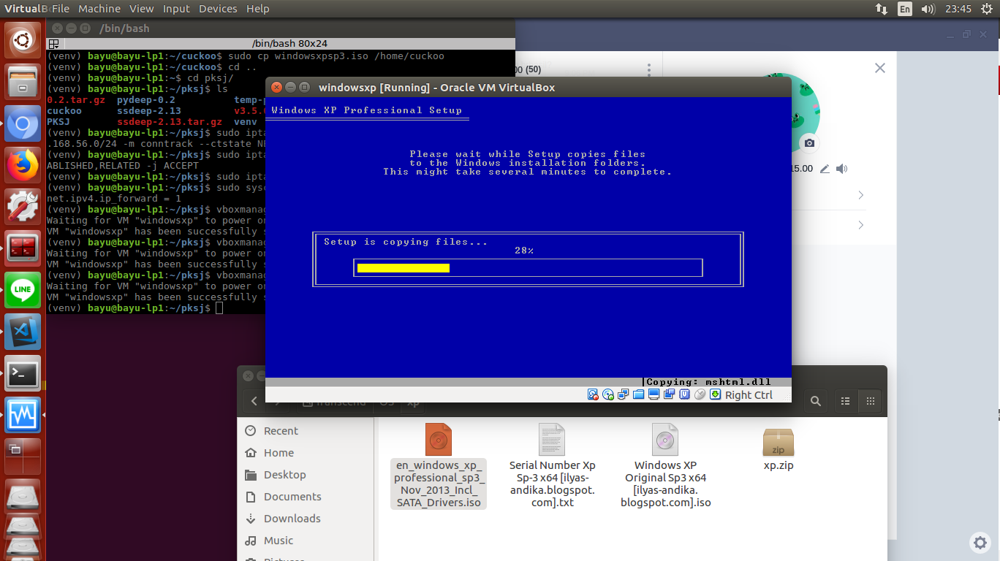
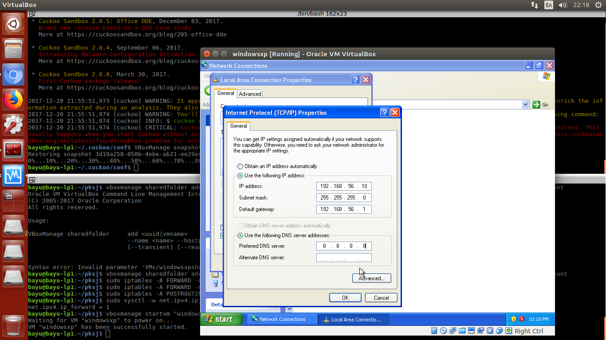
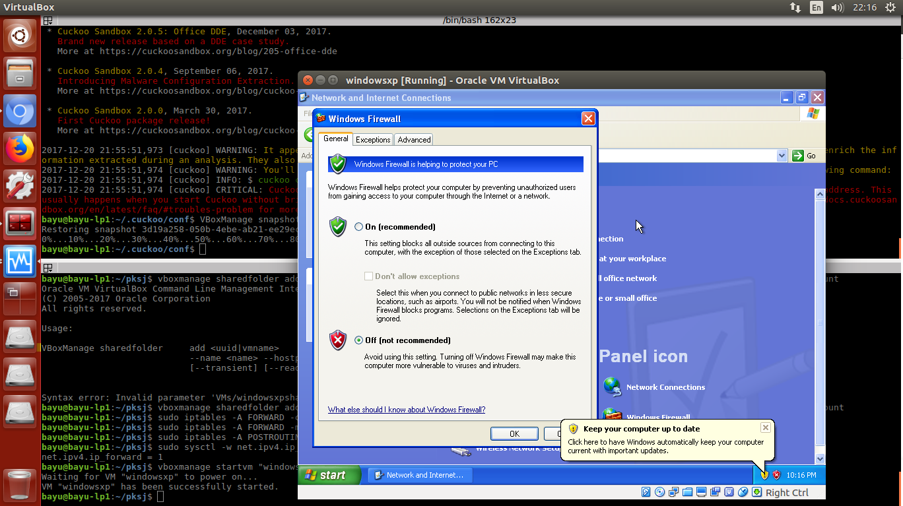
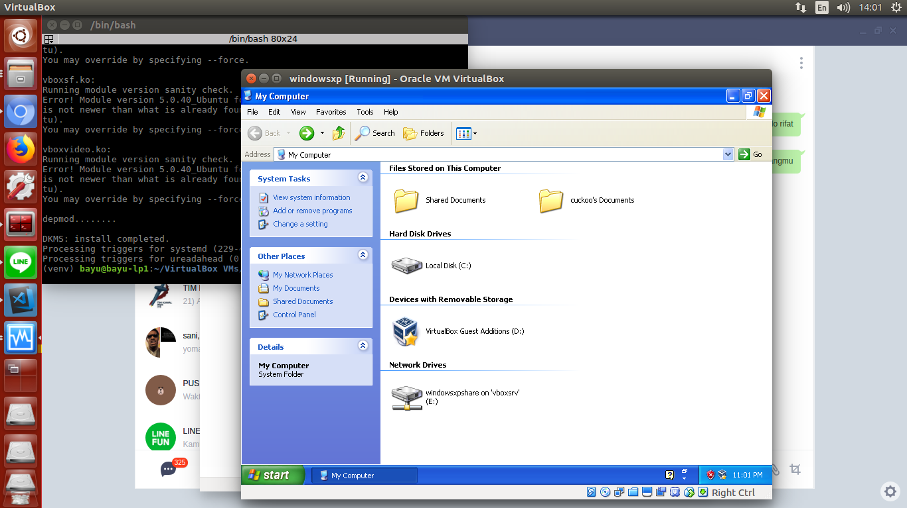
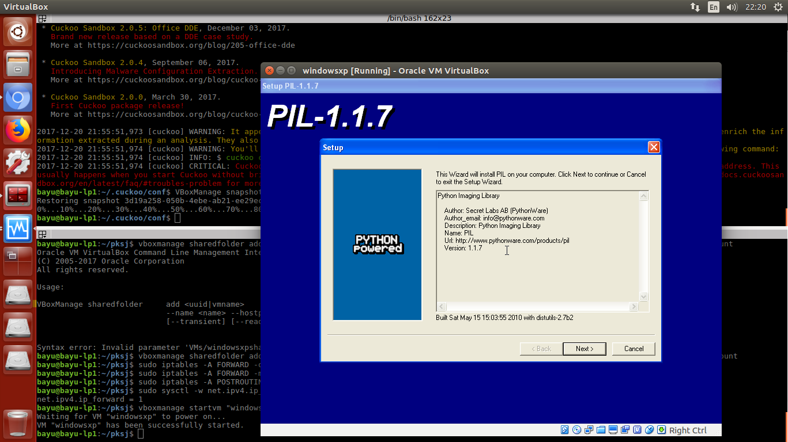
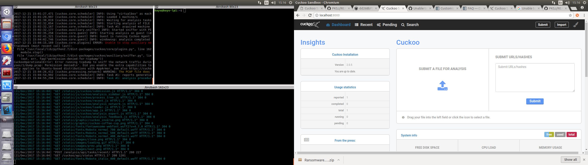

## Dasar Teori

## Cuckoo

Cuckoo Sandbox merupakan sebuah software open source untuk analysis dari files yang mencurigakan saat dijalankan pada environment yang terisolasi.


### Malware 

Malware berasal dari kata malicious software yang artinya malicious (berniat jahat) dan software (perangkat lunak). dalam arti lain perangkat lunak yang diciptakan untuk menyusup atau merusak sistem komputer, server, dan jarinang. malware dapat berupa virus komputer, worm, trojan, rootkit, spyware, dan ransomware.

### Tools yang digunakan

Host:
- Ubuntu 16.04 LTS
- 8 Ram
- Virtualbox 5.0.40_Ubuntu r115130
- Cuckoo Sandbox 2.0.5

Guest:
- Windows XP SP3
- 1 GB Ram

### Persiapan pada Host:

- Installing pakage yang dibutuhkan
```
$ sudo apt-get install git mongodb libffi-dev build-essential python-django python python-dev python-pip python-pil python-sqlalchemy python-bson python-dpkt python-jinja2 python-magic python-pymongo python-gridfs python-libvirt python-bottle python-pefile python-chardet tcpdump -y
```
- Configurasi Tcpdump
```
$ sudo setcap cap_net_raw,cap_net_admin=eip /usr/sbin/tcpdump
```
- Verify hasil configurasi
```
$ getcap /usr/sbin/tcpdump

/usr/sbin/tcpdump = cap_net_admin,cap_net_raw+eip
```
- Installing Yara
```
$ sudo apt-get install autoconf libtool libjansson-dev libmagic-dev libssl-dev -y
$ wget https://github.com/plusvic/yara/archive/v3.4.0.tar.gz -O yara-3.4.0.tar.gz
$ tar -zxf yara-3.4.0.tar.gz
$ cd yara-3.4.0
$ ./bootstrap.sh
$ ./configure --with-crypto --enable-cuckoo --enable-magic
$ make
$ sudo make install
```
- Verifikasi Yara
```
$ yara -v
yara 3.4.0
```
- build dan install yara-python exptension:
```
$ cd yara-python
$ python setup.py build
$ sudo python setup.py install
```
- Validasi installasi
```
$ pip show yara-python
```
- Installing ssdeep
```
$ wget http://sourceforge.net/projects/ssdeep/files/ssdeep-2.13/ssdeep-2.13.tar.gz/download -O ssdeep-2.13.tar.gz
$ tar -zxf ssdeep-2.13.tar.gz
$ cd ssdeep-2.13
$ ./configure
$ make
$ sudo make install
```
- validasi installasi ssdeep
```
$ ssdeep -V
```
- Installing pydeep
```
$ pip install pydeep
```
- Validasi isntallasi pydeep
```
$ pip show pydeep
```
- Installing Volatility
```
$ pip install openpyxl
$ pip install ujson
$ pip install pycrypto
$ pip install distorm3
$ pip install pytz
$ git clone https://github.com/volatilityfoundation/volatility.git
$ cd volatility
$ python setup.py build
$ python setup.py install
```
- Validasi instalasi
```
$ python vol.py -h
```
- Instalasi Cuckoo
```
$ git clone git://github.com/cuckoosandbox/cuckoo.git
```

### Pesiapan guest

- installing VirtualBox
```
$ sudo apt-get install vitualbox
```

- Membuat Virtual Machine
```
$ vboxmanage createvm --name "windowsxp" --ostype WindowsXP --register  
$ vboxmanage modifyvm "windowsxp" --memory 1000 --acpi on --boot1 dvd --nic1 nat  
$ vboxmanage createhd --filename "windowsxp.vdi" --size 12000
$ vboxmanage storagectl "windowsxp" --name "IDE Controller" --add ide --controller PIIX4  
$ vboxmanage storageattach "windowsxp" --storagectl "IDE Controller" --port 0 --device 0 --type hdd --medium "windowsxp.vdi"  
$ vboxmanage storageattach "windowsxp" --storagectl "IDE Controller" --port 0 --device 1 --type dvddrive --medium /home/{$user}/windowsxpsp3.iso
$ vboxmanage hostonlyif create
$ vboxmanage modifyvm "windowsxp" --nic1 hostonly  
$ vboxmanage modifyvm "windowsxp" --hostonlyadapter1 vboxnet0
```
- membuat share folder host dengan guest
```
$ mkdir -p /home/{$user}/VirtualBox\ VMs/windowsxpshare
$ vboxmanage sharedfolder add "windowsxp" --name "windowsxpshare" --hostpath /home/{$user}/VirtualBox\ VMs/windowsxpshare --automount 
$ cp /home/{$user}/.cuckoo/agent/agent.py /home/{$user}/VirtualBox VMs/windowsxpshare/agent.pyw
```
- Membuat virtualbox agar bisa mengakses internet
```
$ sudo iptables -A FORWARD -o eth0 -i vboxnet0 -s 192.168.56.0/24 -m conntrack --ctstate NEW -j ACCEPT
$ sudo iptables -A FORWARD -m conntrack --ctstate ESTABLISHED,RELATED -j ACCEPT
$ sudo iptables -A POSTROUTING -t nat -j MASQUERADE
$ sudo sysctl -w net.ipv4.ip_forward=1
```

### instalasi dan configurasi Guest OS
Jalankan perintah untuk menjalankan virtualbox yang telah kita siapkan
```
$ vboxmanage startvm "windowsxp"
```

- config IP


- Matikan Firewall dan autoupdate


- install Guest Additions pada virtual box



configurasi network pada Guest OS
matikan update otomatis dan firewall
- instalasi python 2.7

- Taking a snapshot
```
$ vboxmanage snapshot "windowsxp" take "snapshot1" --pause
$ vboxmanage controlvm "windowsxp" poweroff
$ vboxmanage snapshot "windowsxp" restorecurrent
```
### Configuring Cuckoo
- cuckoo.conf
```
machinery = virtualbox
[resultserver]
ip = 192.168.56.1 #This is the IP address of the host
port = 2042 #leave default unless you have services running
```
- auxiliary.conf
```
[sniffer]
# Enable or disable the use of an external sniffer (tcpdump) [yes/no].
enabled = yes

# Specify the path to your local installation of tcpdump. Make sure this
# path is correct.
# You can check this using the command: whereis tcpdump
tcpdump = /usr/sbin/tcpdump

# Specify the network interface name on which tcpdump should monitor the
# traffic. Make sure the interface is active.
# The ifconfig command will show you the interface name.
interface = vboxnet0
```

- virtualbox.conf
```
machines = windowsxp

[windowsxp]
label = windowsxp
platform = windows
ip = 192.168.56.10 # IP address of the guest
snapshot = snapshot1 # name of snapshot
```

- reporting.conf
```
[mongodb]
enabled = yes
```

Start Cuckoo
```
$ sudo Cuckoo
```
dan run web interface:
```
$ sudo Cuckoo web
```


- Download dan ekstract malware untuk melakukan tes pada repository
disini kita akan memakai kelihos
https://github.com/ytisf/theZoo/blob/master/malwares/Binaries/Kelihos/Kelihos.zip
- ekstract malware dan upload
- tunggul dan lihat hasil analisisnya
